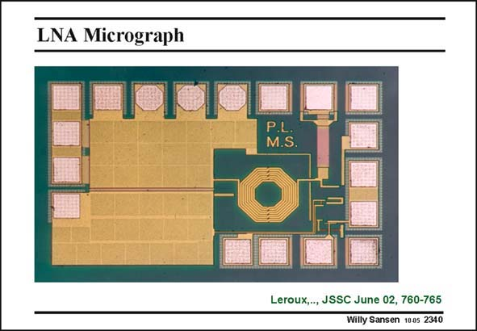

# SANSEN-2340 · LNA Micrograph

章节：23 低噪声放大器  
PDF 页：719；书本页：731；幻灯片编号：2340  
状态：unreviewed



## 对应教材讲解

### PDF 719 · 书本 731

This is a microphotograph of the LNA. The input and the output are easily recognized. Also, the protection diodes and the transistors are visible. Finally, the load inductor and C and C , the capaci- 1 2 tive divider can be found. These large objects on the left are the decoupling capacitors.

## 公式／性能结论候选摘录

以下为规则截取的原文，尚未逐项判读。

（未由规则找到；不代表原页没有此类内容。）

## 曲线结论候选摘录

以下为规则截取的原文，尚未逐项判读。

（未由规则找到；不代表原页没有此类内容。）

## 原文条件与近似候选摘录

以下为规则截取的原文，尚未逐项判读。

（未由规则找到；不代表原页没有此类内容。）

## 幻灯片 OCR（未校正）

```text
LNA Micrograph
P.L.
M.S.
Leroux,, JSSC June 02, 760-765
Willy Sansen 1005 2340
```

数学上下标、分数及正负号以原图为准。电路图已保留；未核对的连接不输出成可仿真 netlist。
