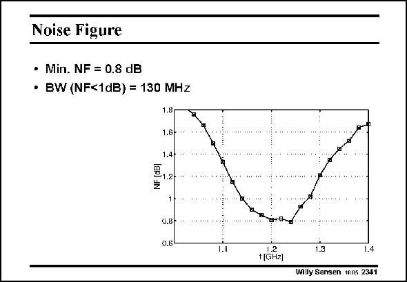

# SANSEN-2341 · Noise Figure

章节：23 低噪声放大器  
PDF 页：719；书本页：731；幻灯片编号：2341  
状态：unreviewed



## 对应教材讲解

### PDF 719 · 书本 731

The Noise Figure of the LNA was measured using a noise figure analyzer. This measurement was performed while the LNA was operating in its nominal 9 mW (at 1.5 V supply voltage) regime. The Noise Figure of the LNA reaches a minimum of 0.79 dB at the frequency of operation. The NF stays below 1 dB for a bandwidth of about 130 MHz and stays below 2 dB for more than 400 MHz around the working frequency.

## 公式／性能结论候选摘录

以下为规则截取的原文，尚未逐项判读。

- PDF 719: The NF stays below 1 dB for a bandwidth of about 130 MHz and stays below 2 dB for more than 400 MHz around the working frequency.

## 曲线结论候选摘录

以下为规则截取的原文，尚未逐项判读。

（未由规则找到；不代表原页没有此类内容。）

## 原文条件与近似候选摘录

以下为规则截取的原文，尚未逐项判读。

（未由规则找到；不代表原页没有此类内容。）

## 幻灯片 OCR（未校正）

```text
Noise Figure
• Min. NF = 0.8 dB
• BW (NF<1dB) = 130 MHz
1.8
1.6-
1.4
3,2-
0.8-
0.5
1.1
1.2
f[GHz)
1.3
14
Willy Sansen 1005 2341
```

数学上下标、分数及正负号以原图为准。电路图已保留；未核对的连接不输出成可仿真 netlist。
