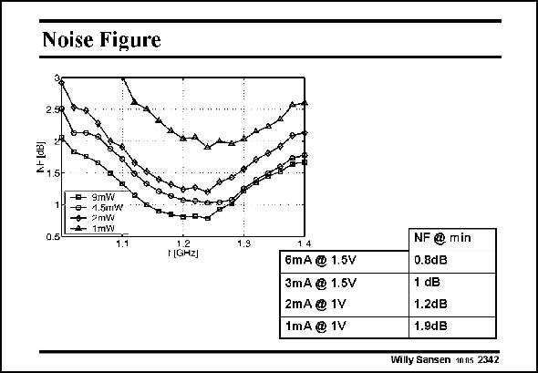

# SANSEN-2342 · Noise Figure

章节：23 低噪声放大器  
PDF 页：720；书本页：732；幻灯片编号：2342  
状态：unreviewed



## 对应教材讲解

### PDF 720 · 书本 732

Further measurements of the noise figure were performed in different power regimes. The bottom curve is the curve shown on the previous slide. The next curve when going up is measured when reducing the bias current to 3mA. The Noise Figure here reaches a minimum of 1 dB. Above that we have the Noise Figure for the LNA while drawing 2 mA from a 1 V supply. The minimum is now 1.2 dB. The final curve was measured drawing 1 mA from a 1 V supply, i.e. consuming only 1 mW. The minimum noise figure is 1.9 dB. Note, however, that the input matching conditions are no longer fulfilled in the last three measurements.

## 公式／性能结论候选摘录

以下为规则截取的原文，尚未逐项判读。

（未由规则找到；不代表原页没有此类内容。）

## 曲线结论候选摘录

以下为规则截取的原文，尚未逐项判读。

- PDF 720: The bottom curve is the curve shown on the previous slide.
- PDF 720: The next curve when going up is measured when reducing the bias current to 3mA.
- PDF 720: The final curve was measured drawing 1 mA from a 1 V supply, i.e. consuming only 1 mW.

## 原文条件与近似候选摘录

以下为规则截取的原文，尚未逐项判读。

（未由规则找到；不代表原页没有此类内容。）

## 幻灯片 OCR（未校正）

```text
Noise Figure
9mW
1.5W
2mw
1mW
1.7
1164z)
1.9
14
6mA @ 1.5V
3mA @ 1.5V
2mA @ 1V
1mA @ 1V
NF@ min
0.8dB
1 dB
1.2dB
1.9dB
Willy Sansen 1nn5 2342
```

数学上下标、分数及正负号以原图为准。电路图已保留；未核对的连接不输出成可仿真 netlist。
