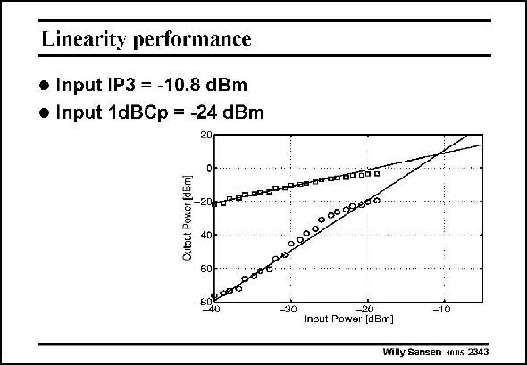

# SANSEN-2343 · Linearity performance

章节：23 低噪声放大器  
PDF 页：720；书本页：732；幻灯片编号：2343  
状态：unreviewed



## 对应教材讲解

### PDF 720 · 书本 732

Finally, the linearity performance of the LNA was measured. The signal power of the first-order output and the third-order intermodulation products are plotted vs. the input power. Linear regression shows an input referred IP3 of −10.8 dBm. Although linearity is not always that important, this value would be sufficient for the very stringent linearity specification of the GSM system. The −1 dB compression point is measured to be at −24 dBm.

## 公式／性能结论候选摘录

以下为规则截取的原文，尚未逐项判读。

（未由规则找到；不代表原页没有此类内容。）

## 曲线结论候选摘录

以下为规则截取的原文，尚未逐项判读。

- PDF 720: The signal power of the first-order output and the third-order intermodulation products are plotted vs. the input power.

## 原文条件与近似候选摘录

以下为规则截取的原文，尚未逐项判读。

（未由规则找到；不代表原页没有此类内容。）

## 幻灯片 OCR（未校正）

```text
Linearity performance
• Input IP3 = -10.8 dBm
• Input 1dBCp = -24 dBm
20
Dh.nedooo
Outout Power (dBm])
-2010702000000-00-296040666
0 0000005
40
60
Bneoen
40
-30
Input Power [dBm]
-10
Willy Sansen 1005 2343
```

数学上下标、分数及正负号以原图为准。电路图已保留；未核对的连接不输出成可仿真 netlist。
