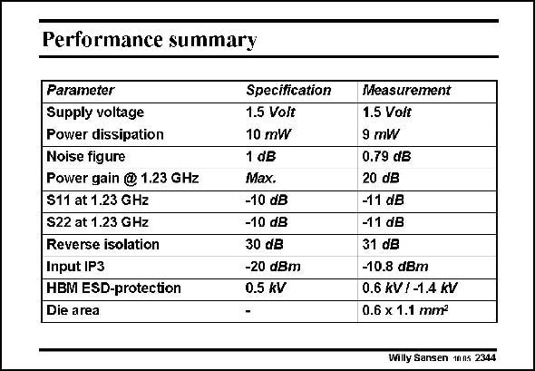

# SANSEN-2344 · Performance summary

章节：23 低噪声放大器  
PDF 页：721；书本页：733；幻灯片编号：2344  
状态：unreviewed



## 对应教材讲解

### PDF 721 · 书本 733

This is a summary of the performance of the LNA compared to the specifications. The supply voltage is 1.5 V. The power dissipation is 9 mW which is lower than the 10 mW specification. The noise figure was measured 0.79 dB, lower than the 1dB specification. The power gain was maximized and is measured to be 20 dB. Input and output reflection are −11 dB. Reverse isolation is larger than 31 dB over the entire spectrum of the network analyzer. The input IP3 is −10.8 dBm which is more than sufficient. A final measurement which was done is a HBM test for the level of ESD protection. The specification put forward was 0.5 kV. Measurements have shown that the LNA input is able to withstand pulses from −1.4 to +0.6 kV, exceeding the specification. Die area is 0.6 by 1.1 mm2.

## 公式／性能结论候选摘录

以下为规则截取的原文，尚未逐项判读。

- PDF 721: The power gain was maximized and is measured to be 20 dB.

## 曲线结论候选摘录

以下为规则截取的原文，尚未逐项判读。

（未由规则找到；不代表原页没有此类内容。）

## 原文条件与近似候选摘录

以下为规则截取的原文，尚未逐项判读。

（未由规则找到；不代表原页没有此类内容。）

## 幻灯片 OCR（未校正）

```text
Performance summary
Parameter
Supply voltage
Power dissipation
Noise figure
Power gain @ 1.23 GHz
S11 at 1.23 GHz
S22 at 1.23 GHz
Reverse isolation
Input IP3
HBM ESD-protection
Die area
Specification
1.5 Volt
10 mW
1 dB
Max.
-10 dB
-10 dB
30 dB
-20 dBm
0.5 kV
Measurement
1.5 Volt
9 mW
0.79 dB
20 dB
-11 dB
-11 dB
31 dB
-10.8 dBm
0.6 kV / -1.4 kV
0.6 x 1.1 mm?
Willy Sansen mns 2341
```

数学上下标、分数及正负号以原图为准。电路图已保留；未核对的连接不输出成可仿真 netlist。
