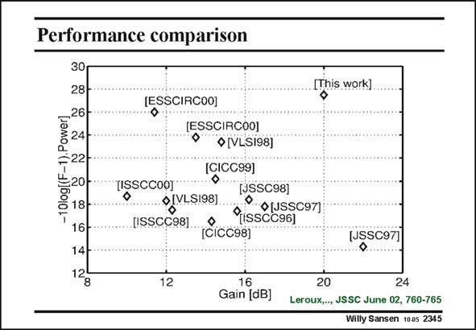

# SANSEN-2345 · Performance comparison

章节：23 低噪声放大器  
PDF 页：721；书本页：733；幻灯片编号：2345  
状态：unreviewed



## 对应教材讲解

### PDF 721 · 书本 733

In this figure, a Figure of merit is plotted vs. the power gain for published CMOS LNAs. The Figure of merit is minus ten times the log of F minus one times power, where F is the Noise Figure. A high Figure of merit means that the LNA scores well in the area of low Noise Figure and low power consumption. As such, the three main performance parameters are shown in this plot. Circuits with a low Noise Figure, a low power consumption and high power gain are located more towards the upper right corner. Most LNAs with very low Noise Figure and/or power consumption also have low power gain and vice versa. This last realization however, succeeds in combining good performance in all three areas.

## 公式／性能结论候选摘录

以下为规则截取的原文，尚未逐项判读。

- PDF 721: In this figure, a Figure of merit is plotted vs. the power gain for published CMOS LNAs.
- PDF 721: Circuits with a low Noise Figure, a low power consumption and high power gain are located more towards the upper right corner.
- PDF 721: Most LNAs with very low Noise Figure and/or power consumption also have low power gain and vice versa.

## 曲线结论候选摘录

以下为规则截取的原文，尚未逐项判读。

- PDF 721: In this figure, a Figure of merit is plotted vs. the power gain for published CMOS LNAs.
- PDF 721: As such, the three main performance parameters are shown in this plot.

## 原文条件与近似候选摘录

以下为规则截取的原文，尚未逐项判读。

（未由规则找到；不代表原页没有此类内容。）

## 幻灯片 OCR（未校正）

```text
Performance comparison
30
28
1) Powerl
-10log[(F.
18
16
14
12
8
(ESSCIRCOO]
(ESSCIRCOO]
•[VLS198]
[CICC99]
•
[ISSCCO0]
o|VL51981
[JSSC98]
P OUSSC97)
CTisscc96)
12
[This work]
(15SC97)
16
Gain [dB]
20
24
Leroux,.., JSSC June 02, 760-765
Willy Sansen 1005 2345
```

数学上下标、分数及正负号以原图为准。电路图已保留；未核对的连接不输出成可仿真 netlist。
