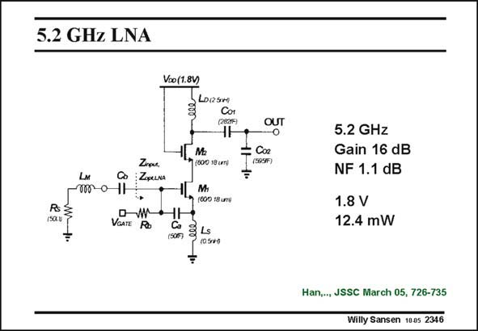

# SANSEN-2346 · 5.2 GHz LNA

章节：23 低噪声放大器  
PDF 页：722；书本页：734；幻灯片编号：2346  
状态：unreviewed



## 对应教材讲解

### PDF 722 · 书本 734

LNA’s at higher frequencies have very much the same design flow as their lower frequency counterparts. Only the inductors are smaller to be able to tune out higher frequencies. An example of an LNA at 5 GHz is given in this slide. It is a conventional singleended cascode amplifier. Two inductors are used again, with only 0.5 nH in the Source. An output matching network is added to obtain 50 V output impedance. The Noise Figure is now quite low.

## 公式／性能结论候选摘录

以下为规则截取的原文，尚未逐项判读。

（未由规则找到；不代表原页没有此类内容。）

## 曲线结论候选摘录

以下为规则截取的原文，尚未逐项判读。

（未由规则找到；不代表原页没有此类内容。）

## 原文条件与近似候选摘录

以下为规则截取的原文，尚未逐项判读。

（未由规则找到；不代表原页没有此类内容。）

## 幻灯片 OCR（未校正）

```text
5.2 GHz LNA
Vso (1.8V)
(282F
Zinpue
10 /00 18 ur
150,8
÷
VGATE RO
1059
÷
OUT
5.2 GHz
Gain 16 dB
NF 1.1 dB
1.8 V
12.4 mW
Han,.., JSSC March 05, 726-735
Willy Sansen 1005 2346
```

数学上下标、分数及正负号以原图为准。电路图已保留；未核对的连接不输出成可仿真 netlist。
