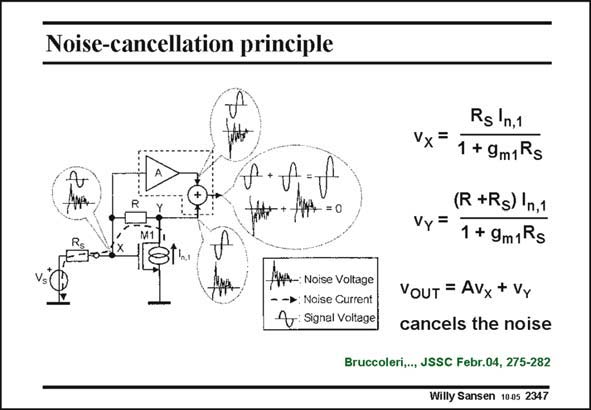

# SANSEN-2347 · Noise-cancellation principle

章节：23 低噪声放大器  
PDF 页：722；书本页：734；幻灯片编号：2347  
状态：unreviewed



## 对应教材讲解

### PDF 722 · 书本 734

An interesting technique to reduce the noise contributed by the input MOST M1, is the circuit schematic in this slide. In this amplifier, the signal itself is inverted from input to output, as in most amplifiers. The voltage caused by the noise current I of input transistor M1 n,1 is not inverted, however. Summation of both signals, with the proper scaling will cancel out the contribution of the noise current I to n,1 the output. The appropriate expressions are given in this slide. The full circuit is given next.

## 公式／性能结论候选摘录

以下为规则截取的原文，尚未逐项判读。

（未由规则找到；不代表原页没有此类内容。）

## 曲线结论候选摘录

以下为规则截取的原文，尚未逐项判读。

（未由规则找到；不代表原页没有此类内容。）

## 原文条件与近似候选摘录

以下为规则截取的原文，尚未逐项判读。

（未由规则找到；不代表原页没有此类内容。）

## 幻灯片 OCR（未校正）

```text
Noise-cancellation principle
p.f.t
/p-: Noise Voltage
- -*: Noise Current|
Signal Voitage
Rs ln,1
Vx=
1 + 9m1Rs
(R +Rs) |n,1
Vy =
1 + 9m1Rs
VOUT = Avx + Vy
cancels the noise
Bruccoleri,.., JSSC Febr.04, 275-282
Willy Sansen 1005 2347
```

数学上下标、分数及正负号以原图为准。电路图已保留；未核对的连接不输出成可仿真 netlist。
