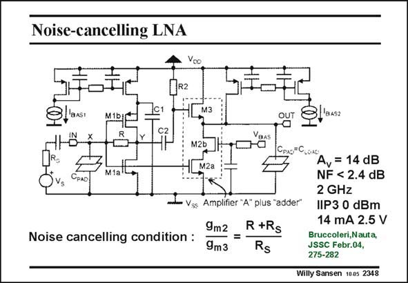

# SANSEN-2348 · Noise-cancelling LNA

章节：23 低噪声放大器  
PDF 页：723；书本页：735；幻灯片编号：2348  
状态：unreviewed



## 对应教材讲解

### PDF 723 · 书本 735

Noise cancellation is subject to the condition given in this slide. The summation or adding amplifier consists of transistors M2a, M2b and M3. The resulting Noise Figure is quite low without a lot of additional power consumption.

## 公式／性能结论候选摘录

以下为规则截取的原文，尚未逐项判读。

（未由规则找到；不代表原页没有此类内容。）

## 曲线结论候选摘录

以下为规则截取的原文，尚未逐项判读。

（未由规则找到；不代表原页没有此类内容。）

## 原文条件与近似候选摘录

以下为规则截取的原文，尚未逐项判读。

（未由规则找到；不代表原页没有此类内容。）

## 幻灯片 OCR（未校正）

```text
Noise-cancelling LNA
1R2
M3
M1b/C
B4S2
C2
M2b
Noise cancelling condition :
Vss Amplifier "A" plus "adder"
9m2
R +Rs
9m3
Rs
LOAG
Av = 14 dB
NF < 2.4 dB
2 GHz
IIP3 0 dBm
14 mA 2.5 V
Bruccoleri,Nauta,
JSSC Febr.04,
275-282
Willy Sansen 1005 2348
```

数学上下标、分数及正负号以原图为准。电路图已保留；未核对的连接不输出成可仿真 netlist。
