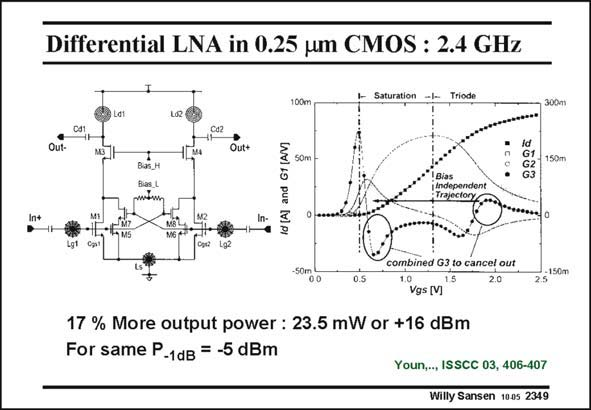

# SANSEN-2349 · Differential LNA in 0.25 um CMOS : 2.4 GHz

章节：23 低噪声放大器  
PDF 页：723；书本页：735；幻灯片编号：2349  
状态：unreviewed



## 对应教材讲解

### PDF 723 · 书本 735

A differential LNA is shown in this slide. Its advantage is that it is less susceptible to spikes and noise on the substrate and the supply lines. However, it takes two times the DC current. It consists of two cascode amplifiers, to which four transistors M5–M8 have been added to suppress the 3rd-order distortion. As a result the −1 dB compression point is at −5 dBm, meaning that the IIP3 is about at 5 dBm, which is quite large indeed. The distortion cancellation operates as follows. For one single MOST the current is given on the right, together with its first three derivatives. The 3rd-order one G3 has a negative peak around a V of 0.7 V. It has a positive peak as well GS at 1.8 V. Another transistor combination M5–M7 is now added which shows a positive peak at only 0.7 V. Addition of its current to the current of the previous transistor allows (partial) cancellation of the 3rd-order distortion components. It is clear that cancellation techniques always suffer from mismatch. Complete cancellation is always hard to achieve. However, an increase of the IIP3 with 5 dBm is normally sufficient. This is the case here.

## 公式／性能结论候选摘录

以下为规则截取的原文，尚未逐项判读。

- PDF 723: As a result the −1 dB compression point is at −5 dBm, meaning that the IIP3 is about at 5 dBm, which is quite large indeed.
- PDF 723: However, an increase of the IIP3 with 5 dBm is normally sufficient.

## 曲线结论候选摘录

以下为规则截取的原文，尚未逐项判读。

- PDF 723: The 3rd-order one G3 has a negative peak around a V of 0.7 V.
- PDF 723: It has a positive peak as well GS at 1.8 V.
- PDF 723: Another transistor combination M5–M7 is now added which shows a positive peak at only 0.7 V.

## 原文条件与近似候选摘录

以下为规则截取的原文，尚未逐项判读。

（未由规则找到；不代表原页没有此类内容。）

## 幻灯片 OCR（未校正）

```text
Differential LNA in 0.25 um CMOS : 2.4 GHz
Saturation
Triode
50m
Id
G1
G2
G3
150ml
O.5
combined G3 to cancel out
1.0
1.5
Vgs [V]
2.0
2.5
17 % More output power: 23.5 mW or +16 dBm
For same P-1dB = -5 dBm
Youn,.., ISSCC 03, 406-407
Willy Sansen 1005 2349
```

数学上下标、分数及正负号以原图为准。电路图已保留；未核对的连接不输出成可仿真 netlist。
