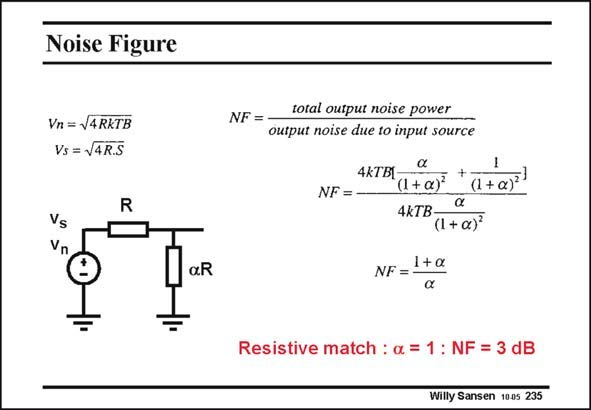

# SANSEN-235 · Noise Figure

章节：23 低噪声放大器  
PDF 页：701；书本页：713；幻灯片编号：235  
状态：unreviewed



## 对应教材讲解

### PDF 701 · 书本 713

If a transmission line with characteristic impedance is terminated in a resistor with the same value, then a division by two occurs. This is shown in this slide. A voltage source with value v has an internal resistance s R. It is matched by a transmission line with load aR. It now presents a resistance aR to the voltage source. For perfect matching the load resistance equals the source resistance and a= 1. Usually, the load resistance is somewhat different; a is larger or smaller. In this case, what is the Noise Figure? Both the signal power S and noise power N are readily calculated at the output. out out The Noise Figure, which is defined as the ratio of the total noise at the output, divided by the noise due only to the source resistance (see Chapter 4), is obtained as given in this slide. For perfect impedance matching, a is unity and the Noise Figure is 2 or 3 dB. This is a typical value for resistive terminations, as shown next.

## 公式／性能结论候选摘录

以下为规则截取的原文，尚未逐项判读。

- PDF 701: For perfect matching the load resistance equals the source resistance and a= 1.

## 曲线结论候选摘录

以下为规则截取的原文，尚未逐项判读。

- PDF 701: If a transmission line with characteristic impedance is terminated in a resistor with the same value, then a division by two occurs.

## 原文条件与近似候选摘录

以下为规则截取的原文，尚未逐项判读。

（未由规则找到；不代表原页没有此类内容。）

## 幻灯片 OCR（未校正）

```text
Noise Figure
Vn = S4RKTB
Vs = V4R.S
R
Vs
Vn
aR
NF =
total output noise power
output noise due to input source
NF =
4KTBI
(1+a) +(1+a)
4kTB-
(1+ a)
1+a
NF =
Resistive match : a = 1 : NF = 3 dB
Willy Sansen 1005 235
```

数学上下标、分数及正负号以原图为准。电路图已保留；未核对的连接不输出成可仿真 netlist。
