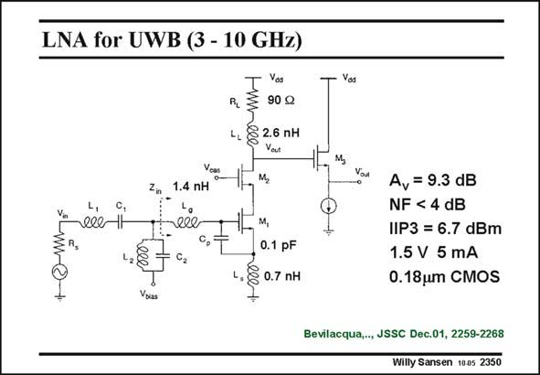

# SANSEN-2350 · LNA for UWB (3 - 10 GHz)

章节：23 低噪声放大器  
PDF 页：724；书本页：736；幻灯片编号：2350  
状态：unreviewed



## 对应教材讲解

### PDF 724 · 书本 736

A wideband LNA for an Ultra-Wide Band receiver is shown in this slide. The frequency extends from 3 to 10 GHz. It has been realized in a fairly conservative 0.18 mm CMOS. The gain is rather low indeed. The capacitance C of p 0.1 pF has been added to C to be tuned out more GS1 accurately by means of inductors L and L . g s A parallel L C network 2 2 is added to broadband the frequency response without impairing the input impedance matching.

## 公式／性能结论候选摘录

以下为规则截取的原文，尚未逐项判读。

- PDF 724: The gain is rather low indeed.

## 曲线结论候选摘录

以下为规则截取的原文，尚未逐项判读。

（未由规则找到；不代表原页没有此类内容。）

## 原文条件与近似候选摘录

以下为规则截取的原文，尚未逐项判读。

（未由规则找到；不代表原页没有此类内容。）

## 幻灯片 OCR（未校正）

```text
LNA for UWB (3 - 10 GHz)
1.4 nH
ell
Yos
90 g
4 26 nн
M,
M,
0.1 pF
1, § 0.7 пн
Yos
A, = 9.3 dB
NF < 4 dB
IIP3 = 6.7 dBm
1.5 V 5 mA
0.18um CMOS
Bevilacqua,.., JSSC Dec.01, 2259-2268
Willy Sansen 1005 2350
```

数学上下标、分数及正负号以原图为准。电路图已保留；未核对的连接不输出成可仿真 netlist。
