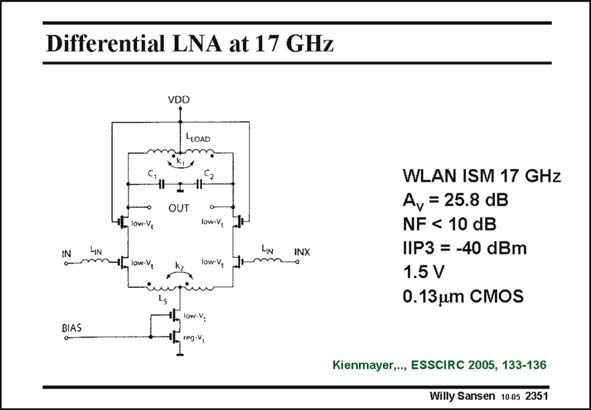

# SANSEN-2351 · Differential LNA at 17 GHz

章节：23 低噪声放大器  
PDF 页：724；书本页：736；幻灯片编号：2351  
状态：unreviewed



## 对应教材讲解

### PDF 724 · 书本 736

A differential LNA for a WLAN ISM receiver is shown in this slide. The advantage of a differential configuration is that it rejects substrate noise much better. The input antenna must then be followed by a balun. This is a toroidal RF transformer which converts the single-ended input into a symmetrical output. The configuration is a well known cascode stage. The gain is fairly high. As a result the IIP3 is rather low.

## 公式／性能结论候选摘录

以下为规则截取的原文，尚未逐项判读。

- PDF 724: The gain is fairly high.
- PDF 724: As a result the IIP3 is rather low.

## 曲线结论候选摘录

以下为规则截取的原文，尚未逐项判读。

（未由规则找到；不代表原页没有此类内容。）

## 原文条件与近似候选摘录

以下为规则截取的原文，尚未逐项判读。

（未由规则找到；不代表原页没有此类内容。）

## 幻灯片 OCR（未校正）

```text
Differential LNA at 17 GHz
11-
VDD
40лo
-IH
OUT
IN
low-V,
-.lowV
low-va
Towv, 1
INX
WLAN ISM 17 GHz
A, = 25.8 dB
NF < 10 dB
IIP3 = -40 dBm
1.5 V
0.13um CMOS
BIAS
Kienmayer,.., ESSCIRC 2005, 133-136
Willy Sansen 1005 2351
```

数学上下标、分数及正负号以原图为准。电路图已保留；未核对的连接不输出成可仿真 netlist。
