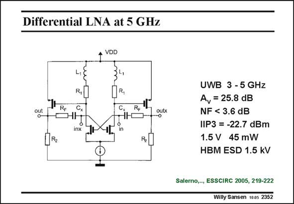

# SANSEN-2352 · Differential LNA at 5 GHz

章节：23 低噪声放大器  
PDF 页：725；书本页：737；幻灯片编号：2352  
状态：unreviewed



## 对应教材讲解

### PDF 725 · 书本 737

Another differential LNA for UWB up to 5 GHz is shown in this slide. As it is the differential, the sensitivity to substrate coupling is quite small. It consists of two gain stages with resistive feedback. As a result, the linearity is improved over the full bandwidth. The gain is quite high. As a result, the IIP3 is rather low. A gain reduction mode is provided however, which yields a better IIP3. Note that the ESD protection is included. The input can withstand 1.5 kV. This is why we focus now on the impact of ESD protection networks on the performance of the LNA’s.

## 公式／性能结论候选摘录

以下为规则截取的原文，尚未逐项判读。

- PDF 725: It consists of two gain stages with resistive feedback.
- PDF 725: As a result, the linearity is improved over the full bandwidth.
- PDF 725: The gain is quite high.
- PDF 725: As a result, the IIP3 is rather low.
- PDF 725: A gain reduction mode is provided however, which yields a better IIP3.

## 曲线结论候选摘录

以下为规则截取的原文，尚未逐项判读。

（未由规则找到；不代表原页没有此类内容。）

## 原文条件与近似候选摘录

以下为规则截取的原文，尚未逐项判读。

- PDF 725: A gain reduction mode is provided however, which yields a better IIP3.

## 幻灯片 OCR（未校正）

```text
Differential LNA at 5 GHz
VDD
L,
CHI!
inx
[R,
C,
R, 'T
1Ю
5°
outx
UWB 3 - 5 GHz
Av = 25.8 dB
NF < 3.6 dB
IIP3 = -22.7 dBm
1.5 V 45 mW
HBM ESD 1.5 kV
Salerno,.., ESSCIRC 2005, 219-222
Willy Sansen 1005 2352
```

数学上下标、分数及正负号以原图为准。电路图已保留；未核对的连接不输出成可仿真 netlist。
