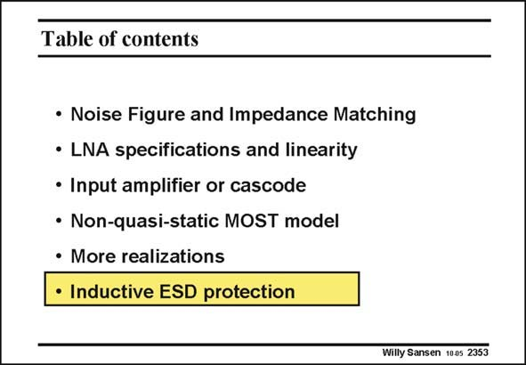

# SANSEN-2353 · Table of contents

章节：23 低噪声放大器  
PDF 页：725；书本页：737；幻灯片编号：2353  
状态：unreviewed



## 对应教材讲解

### PDF 725 · 书本 737

The LNA is normally the first active building block in a receiver. As it is connected directly to the input pad over a bonding wire, it receives electrostatic discharge voltages from outside. These voltages can be quite high (kV’s) and can easily zap the Gate of the input transistor. A protection device is now required. Normally, this consists of series resistances to the Gate and parallel diodes to ground. A low-resistance path is now realized for overvoltages. This is discussed in more detail next.

## 公式／性能结论候选摘录

以下为规则截取的原文，尚未逐项判读。

（未由规则找到；不代表原页没有此类内容。）

## 曲线结论候选摘录

以下为规则截取的原文，尚未逐项判读。

（未由规则找到；不代表原页没有此类内容。）

## 原文条件与近似候选摘录

以下为规则截取的原文，尚未逐项判读。

（未由规则找到；不代表原页没有此类内容。）

## 幻灯片 OCR（未校正）

```text
Table of contents
• Noise Figure and Impedance Matching
• LNA specifications and linearity
• Input amplifier or cascode
• Non-quasi-static MOST model
• More realizations
• Inductive ESD protection
Willy Sansen 1005 2353
```

数学上下标、分数及正负号以原图为准。电路图已保留；未核对的连接不输出成可仿真 netlist。
