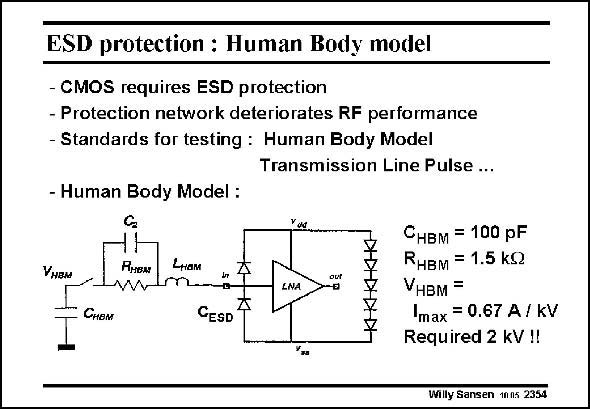

# SANSEN-2354 · ESD protection : Human Body model

章节：23 低噪声放大器  
PDF 页：726；书本页：738；幻灯片编号：2354  
状态：unreviewed



## 对应教材讲解

### PDF 726 · 书本 738

ESD protection networks can be tested in various ways. The simplest model of an ESD source is probably the Human Body Model. It models a human who discharges into a pin. It consists of a capacitor C HBM which is charged to a high voltage (kV’s) and discharged over a small resistor R (about 1500 V) and HBM bonding wire inductor L HBM to the input pad. A small parasitic capacitor C is pre- 2 sent as well. A protection diode is therefore connected to supply and ground. It must be able to take large currents to avoid large voltages at the Gate. In this example, the diode must be able to conduct 0.67 A/kV overvoltage. It takes a fairly large area, and gives a fairly large capacitor at the input of the LNA. ESD protection diodes add capacitances to ground however, after the Gate inductance L . HBM The tuning out of the C capacitance is disturbed somewhat, leading to smaller values of R GS and larger transistor sizes. These capacitances can be tuned out as well. It is always preferable however, to keep the input matching network as simple as possible.

## 公式／性能结论候选摘录

以下为规则截取的原文，尚未逐项判读。

- PDF 726: A protection diode is therefore connected to supply and ground.

## 曲线结论候选摘录

以下为规则截取的原文，尚未逐项判读。

（未由规则找到；不代表原页没有此类内容。）

## 原文条件与近似候选摘录

以下为规则截取的原文，尚未逐项判读。

（未由规则找到；不代表原页没有此类内容。）

## 幻灯片 OCR（未校正）

```text
ESD protection : Human Body model
- CMOS requires ESD protection
- Protection network deteriorates RF performance
- Standards for testing : Human Body Model
Transmission Line Pulse ...
- Human Body Model :
Yưa...
VнвM
PнEA!
LнaM
LNA
ouf
-E
Снвм
GESD
Снвм = 100 pF
RнвM = 1.5 kQ
VHBM=
Imax = 0.67 A / KV
Required 2 kV !!
Уzа
Willy Sansen 1005 2354
```

数学上下标、分数及正负号以原图为准。电路图已保留；未核对的连接不输出成可仿真 netlist。
