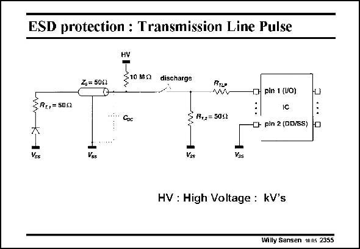

# SANSEN-2355 · ESD protection : Transmission Line Pulse

章节：23 低噪声放大器  
PDF 页：726；书本页：738；幻灯片编号：2355  
状态：unreviewed



## 对应教材讲解

### PDF 726 · 书本 738

A HBM models a human. Another way to stress the input protection is to charge a transmission line (Z = o 50 V) to a high voltage and to discharge it through a large resistor R to the TLP input pin. Resistors R and R T,1 T,2 are added to avoid reflections on both ends. The diode on the left end is added to avoid leakage to ground during charging. The following test procedure is normally adopted. The stress test is executed between two pins (here pin1 and pin 2). First of all, the leakage current is measured between these two pins. Then a high voltage discharge is applied after which the leakage current is measured again. The discharge voltage is stepped up until the leakage current has become excessive. An example of such a TLP test is given at the end of this Chapter.

## 公式／性能结论候选摘录

以下为规则截取的原文，尚未逐项判读。

（未由规则找到；不代表原页没有此类内容。）

## 曲线结论候选摘录

以下为规则截取的原文，尚未逐项判读。

（未由规则找到；不代表原页没有此类内容。）

## 原文条件与近似候选摘录

以下为规则截取的原文，尚未逐项判读。

（未由规则找到；不代表原页没有此类内容。）

## 幻灯片 OCR（未校正）

```text
ESD protection : Transmission Line Pulse
Zp= 5052
HY
§10 MS
discharge
RTLe
-C pin 1 (UO)
SRo, = 5052
K-1
Ves
F7,2 = 5051
-•- pin 2 (DD/SS)
Vos
Vss
Vss
HV : High Voltage : kV's
Willy Sansen mns 2355
```

数学上下标、分数及正负号以原图为准。电路图已保留；未核对的连接不输出成可仿真 netlist。
