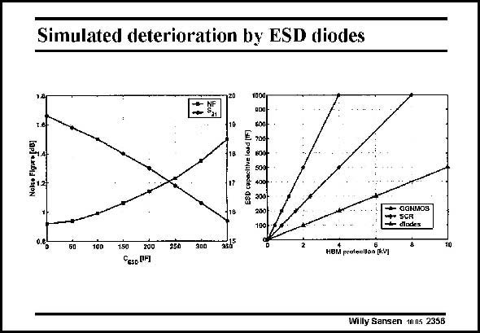

# SANSEN-2356 · Simulated deterioration by ESD diodes

章节：23 低噪声放大器  
PDF 页：727；书本页：739；幻灯片编号：2356  
状态：unreviewed



## 对应教材讲解

### PDF 727 · 书本 739

For sake of illustration, the effect is shown of the ESD capacitance on the Noise Figure for a 1.6 GHz LNA (in 0.25 mm CMOS). The current is 6 mA. The input C is about 0.15 pF. GS For a C increasing to ESD 0.35 pF, the NF increases from 0.9 dB to 1.5 dB. The power gain then decreases from 19.3 to 15.7 dB. This ESD protection provides better protection, as shown in the second plot.

## 公式／性能结论候选摘录

以下为规则截取的原文，尚未逐项判读。

- PDF 727: GS For a C increasing to ESD 0.35 pF, the NF increases from 0.9 dB to 1.5 dB.
- PDF 727: The power gain then decreases from 19.3 to 15.7 dB.

## 曲线结论候选摘录

以下为规则截取的原文，尚未逐项判读。

- PDF 727: This ESD protection provides better protection, as shown in the second plot.

## 原文条件与近似候选摘录

以下为规则截取的原文，尚未逐项判读。

（未由规则找到；不代表原页没有此类内容。）

## 幻灯片 OCR（未校正）

```text
Simulated deterioration by ESD diodes
1000
ESD capocitive losd (**)
GONMOS
diodes
0.6b
50
100
1.50
250
300
HEM profeeion fkvl
Cesp UH
Willy Sansen 1005 2358
```

数学上下标、分数及正负号以原图为准。电路图已保留；未核对的连接不输出成可仿真 netlist。
