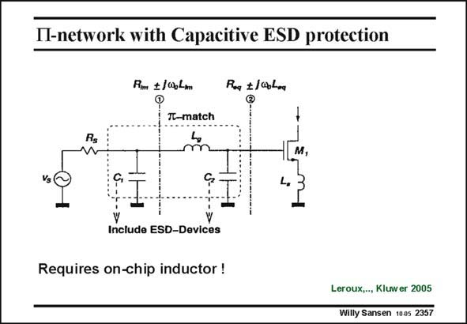

# SANSEN-2357 · П-network with Capacitive ESD protection

章节：23 低噪声放大器  
PDF 页：727；书本页：739；幻灯片编号：2357  
状态：unreviewed



## 对应教材讲解

### PDF 727 · 书本 739

If capacitive protection devices are used, it is now better to connect them in a p-network, as shown in this slide. The addition of an inductor L inbetween ing creases the protection somewhat. This inductor is actually too small to play a role at the ESD-frequencies. It does play a role for the input impedance matching at the RF frequencies. Also, any parasitic capacitance at the Gate of the MOST to ground, can be absorbed by the ESD-device capacitance C . This latter capacitor must always be included in 2 the design process, for high-frequency LNA’s. The design of such a p-network is not obvious, as even more degrees of freedom are available. However, the main concern is to make C as small as possible. 1 The Noise Figure will be reduced somewhat as the inductor L has some series resistance g (typically 2 V/nH).

## 公式／性能结论候选摘录

以下为规则截取的原文，尚未逐项判读。

（未由规则找到；不代表原页没有此类内容。）

## 曲线结论候选摘录

以下为规则截取的原文，尚未逐项判读。

（未由规则找到；不代表原页没有此类内容。）

## 原文条件与近似候选摘录

以下为规则截取的原文，尚未逐项判读。

（未由规则找到；不代表原页没有此类内容。）

## 幻灯片 OCR（未校正）

```text
П-network with Capacitive ESD protection
Rm +/0bLm
Roq $/obLaa
It-match
m
M,
Include ESD-Devices
Requires on-chip inductor !
Leroux,.., Kluwer 2005
Willy Sansen 1005 2357
```

数学上下标、分数及正负号以原图为准。电路图已保留；未核对的连接不输出成可仿真 netlist。
