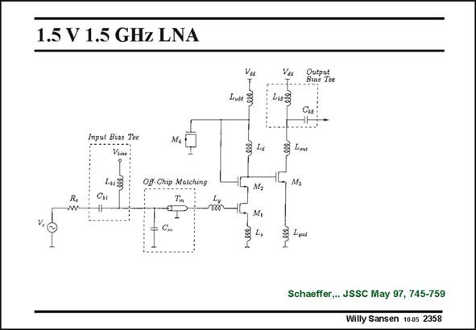

# SANSEN-2358 · 1.5 V 1.5 GHz LNA

章节：23 低噪声放大器  
PDF 页：728；书本页：740；幻灯片编号：2358  
状态：unreviewed



## 对应教材讲解

### PDF 728 · 书本 740

An example of such a p-network is shown in this slide. The capacitance C of the m ESD protection is also part of the matching network. It forms a p-network with the input capacitance of M1. The LNA is a singleended cascode amplifier, with a second amplification stage to provide a 50 V output resistance.

## 公式／性能结论候选摘录

以下为规则截取的原文，尚未逐项判读。

（未由规则找到；不代表原页没有此类内容。）

## 曲线结论候选摘录

以下为规则截取的原文，尚未逐项判读。

（未由规则找到；不代表原页没有此类内容。）

## 原文条件与近似候选摘录

以下为规则截取的原文，尚未逐项判读。

（未由规则找到；不代表原页没有此类内容。）

## 幻灯片 OCR（未校正）

```text
1.5 V 1.5 GHz LNA
Input Bias Tee
Viu
O- Chip Matching
Lid
M,
M,
Toe
Lusa
Cas
3 Lons
M,
Schaeffer,. JSSC May 97, 745-759
Willy Sansen 1005 2358
```

数学上下标、分数及正负号以原图为准。电路图已保留；未核对的连接不输出成可仿真 netlist。
