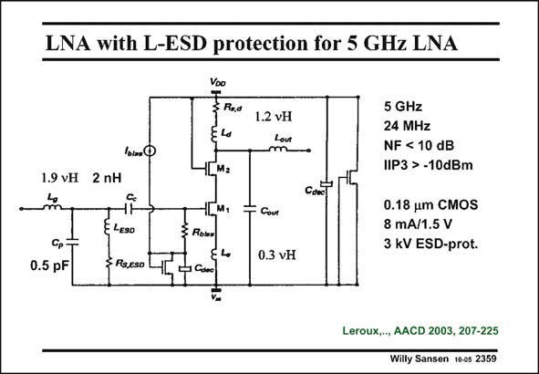

# SANSEN-2359 · LNA with L-ESD protection for 5 GHz LNA

章节：23 低噪声放大器  
PDF 页：728；书本页：740；幻灯片编号：2359  
状态：unreviewed



## 对应教材讲解

### PDF 728 · 书本 740

As an ESD-protection, an inductor can be used instead of a capacitor as well. This is shown in this slide. Inductor l is used to ESD short the low-frequency ESD currents to ground while it forms a parallel resonant circuit with parasitic capacitance C , such that it p is invisible for RF voltages. Clearly, the ESD inductor has some series resistance as well R . It is clear that S,ESD this resistance must be minimized. Capacitor C is a coupling capacitor for RF voltages. The low-frequency ESD signals see a c low-pass filter to ground. The high-frequency RF signals see a high-pass filter to the input Gate. The advantage of this protection is that for a capacitive protection an inductor must be added to tune out the parasitic capacitances of the protection components. For an inductive protection, nothing must be added. The protection inductor can be used to tune out existing parasitic capacitances. For noise, the inductive protection is better as no resistances are added in series with the input Gate. Inductor L is 2 nH; it is realized by a string of five diodes, giving 3 V series resistance only. ESD It takes an area of about 130 mm2. This inductor forms a parallel resistance of 1 kV together with C , which is sufficiently high not to impair the noise performance. p

## 公式／性能结论候选摘录

以下为规则截取的原文，尚未逐项判读。

（未由规则找到；不代表原页没有此类内容。）

## 曲线结论候选摘录

以下为规则截取的原文，尚未逐项判读。

（未由规则找到；不代表原页没有此类内容。）

## 原文条件与近似候选摘录

以下为规则截取的原文，尚未逐项判读。

（未由规则找到；不代表原页没有此类内容。）

## 幻灯片 OCR（未校正）

```text
LNA with L-ESD protection for 5 GHz LNA
Voo
T Rus
1.2 VH
lbinO
1.9 VH 2 nH
Cp
0.5 pF
E LESO
§ RSLESO
ILM.
НДМ,
3 Rose
y Can
- Coue
0.3 VH
5 GHz
24 MHz
NF < 10 dB
IIP3 > -10dBm
0.18 um CMOS
8 mA/1.5 V
3 kV ESD-prot.
Leroux..., AACD 2003, 207-225
Willy Sansen 10-0s 2359
```

数学上下标、分数及正负号以原图为准。电路图已保留；未核对的连接不输出成可仿真 netlist。
