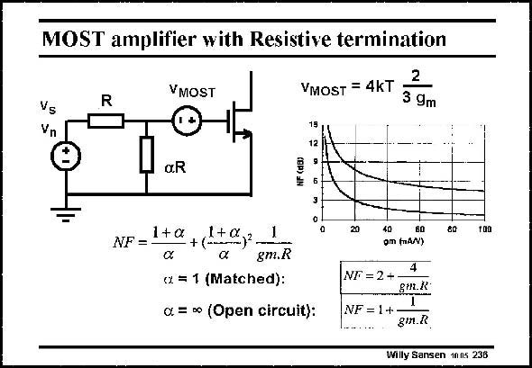

# SANSEN-236 · MOST amplifier with Resistive termination

章节：23 低噪声放大器  
PDF 页：701；书本页：713；幻灯片编号：236  
状态：unreviewed



## 对应教材讲解

### PDF 701 · 书本 713

If a single transistor is taken as a LNA, to which a resistor aR is added for proper termination, then it is clear that the only design parameter left is the transconductance g . Indeed, the Noise m Figure is given in two cases, with perfect matching (a= 1) and without aR. Matching (a=1) is required to avoid reflections. The NF is higher, however. If no matching resistance is present (a=0), then the NF can be higher. Both conditions are plotted versus transconductance g . m Deviations from the matching condition can give higher Noise Figures.

## 公式／性能结论候选摘录

以下为规则截取的原文，尚未逐项判读。

（未由规则找到；不代表原页没有此类内容。）

## 曲线结论候选摘录

以下为规则截取的原文，尚未逐项判读。

- PDF 701: Both conditions are plotted versus transconductance g . m Deviations from the matching condition can give higher Noise Figures.

## 原文条件与近似候选摘录

以下为规则截取的原文，尚未逐项判读。

（未由规则找到；不代表原页没有此类内容。）

## 幻灯片 OCR（未校正）

```text
MOST amplifier with Resistive termination
VMOST
2
VMOST = 4KT
3 9m
Vs
Vn
xR
1+a
1+a
NF = -
+ (-)-
xx
gm.R
ơ = 1 (Matched):
0. = ∞o (Open circuit):
20
40
60
om (nâN)
80
100
NF = 2 +
8m.K
NF = 1+
giл.R
Willy Sansen 1005 236
```

数学上下标、分数及正负号以原图为准。电路图已保留；未核对的连接不输出成可仿真 netlist。
