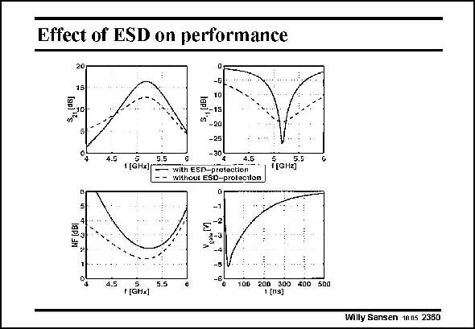

# SANSEN-2360 · Effect of ESD on performance

章节：23 低噪声放大器  
PDF 页：729；书本页：741；幻灯片编号：2360  
状态：unreviewed



## 对应教材讲解

### PDF 729 · 书本 741

The addition of an ESD protection changes the characteristics considerably as shown in this slide. The gain (s ) increases 21 but the Noise Figure decreases around the center frequency of 5 GHz. The input impedance (s ) devi- 11 ates less from 50 V except at one particular frequency, evidently depending on the values of the tuning components.

## 公式／性能结论候选摘录

以下为规则截取的原文，尚未逐项判读。

- PDF 729: The gain (s ) increases 21 but the Noise Figure decreases around the center frequency of 5 GHz.
- PDF 729: The input impedance (s ) devi- 11 ates less from 50 V except at one particular frequency, evidently depending on the values of the tuning components.

## 曲线结论候选摘录

以下为规则截取的原文，尚未逐项判读。

- PDF 729: The addition of an ESD protection changes the characteristics considerably as shown in this slide.

## 原文条件与近似候选摘录

以下为规则截取的原文，尚未逐项判读。

（未由规则找到；不代表原页没有此类内容。）

## 幻灯片 OCR（未校正）

```text
Effect of ESD on performance
20
4.5
1GHKIC
5.5
10
-15|
-20
-25
-30%
4.5
with ESD-profection
Without EsD-protecilon
FaнES"
45 P(SHA 55
ZUb
1 [ns]
Willy Sansen 1005 2360
```

数学上下标、分数及正负号以原图为准。电路图已保留；未核对的连接不输出成可仿真 netlist。
