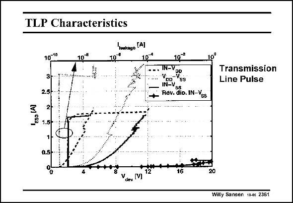

# SANSEN-2361 · TLP Characteristics

章节：23 低噪声放大器  
PDF 页：729；书本页：741；幻灯片编号：2361  
状态：unreviewed



## 对应教材讲解

### PDF 729 · 书本 741

Measured results on the protection network as a result of a TLP test are shown in this slide. The leakage currents before and after the large ESD currents are shown. This is completed for four combinations of pins. Both the available currents from the input terminal towards the positive supply (V ) and ground DD (V ) are quite large. About SS 1 A to ground is reached for a 10 V input voltage. This corresponds to static discharge voltages of up to 3 kV.

## 公式／性能结论候选摘录

以下为规则截取的原文，尚未逐项判读。

- PDF 729: Measured results on the protection network as a result of a TLP test are shown in this slide.

## 曲线结论候选摘录

以下为规则截取的原文，尚未逐项判读。

（未由规则找到；不代表原页没有此类内容。）

## 原文条件与近似候选摘录

以下为规则截取的原文，尚未逐项判读。

（未由规则找到；不代表原页没有此类内容。）

## 幻灯片 OCR（未校正）

```text
TLP Characteristics
10*
10°
'oakugo [A]
ESo (A)
10-10
3-.
2.5-
2-
1.5-
IN-V
Vp=V%s
Hev.dio.m-Vos
Transmission
Line Pulse
0.5-
16
Ydew M
Willy Sansen 10-4s 2361
```

数学上下标、分数及正负号以原图为准。电路图已保留；未核对的连接不输出成可仿真 netlist。
