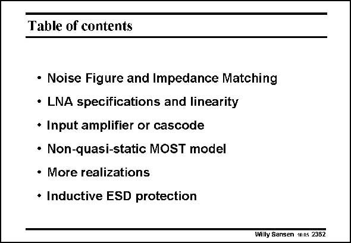

# SANSEN-2362 · Table of contents

章节：23 低噪声放大器  
PDF 页：730；书本页：742；幻灯片编号：2362  
状态：unreviewed



## 对应教材讲解

### PDF 730 · 书本 742

In this Chapter, Low-noise amplifiers (LNA’s) have been discussed which operate at high (RF) frequencies. They have been optimized for low noise and distortion within the constraints of input (and output) impedance matching. The elementary expressions have been derived for impedance matching and noise matching. The two main configurations have been compared. It has been shown that the amplifier input almost always performs better than the cascode input. At these high frequencies the Non-quasi-static behavior of the MOST has sometimes to be taken into account. This is certainly true if the operating frequency is higher than f /3 of T the MOST. Many of the realizations given are commented on. They all exhibit similar circuit configurations but take different compromises in speed, noise and distortion. Finally, considerable attention is paid to the ESD-protection. Indeed, as the LNA is the first active stage in a receiver, it is subject to lightning and other static discharges. Protection components such as diodes and MOSTs must be added, which shift the compromise in the direction of more power consumption and/or noise.

## 公式／性能结论候选摘录

以下为规则截取的原文，尚未逐项判读。

（未由规则找到；不代表原页没有此类内容。）

## 曲线结论候选摘录

以下为规则截取的原文，尚未逐项判读。

（未由规则找到；不代表原页没有此类内容。）

## 原文条件与近似候选摘录

以下为规则截取的原文，尚未逐项判读。

（未由规则找到；不代表原页没有此类内容。）

## 幻灯片 OCR（未校正）

```text
Table of contents
• Noise Figure and Impedance Matching
• LNA specifications and linearity
• Input amplifier or cascode
• Non-quasi-static MOST model
• More realizations
• Inductive ESD protection
Willy Sansen 1nns 2382
```

数学上下标、分数及正负号以原图为准。电路图已保留；未核对的连接不输出成可仿真 netlist。
