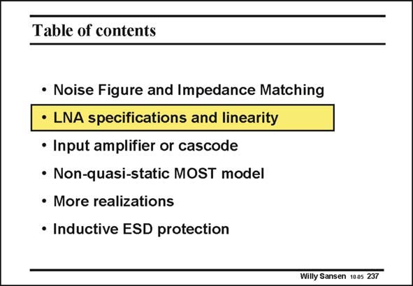

# SANSEN-237 · Table of contents

章节：23 低噪声放大器  
PDF 页：702；书本页：714；幻灯片编号：237  
状态：unreviewed



## 对应教材讲解

### PDF 702 · 书本 714

Input impedance matching and noise are not the only concerns of a LNA. For large input signal amplitudes, distortion will also occur. This is why this aspect is discussed in detail. A compromise will now have to be taken. To have a better feel for these compromises, some attention is paid to all other important specifications. For this purpose, the schematic of a receiver has to be looked at in detail. A receiver in combination with a transmitter is a transceiver. This is shown next.

## 公式／性能结论候选摘录

以下为规则截取的原文，尚未逐项判读。

（未由规则找到；不代表原页没有此类内容。）

## 曲线结论候选摘录

以下为规则截取的原文，尚未逐项判读。

（未由规则找到；不代表原页没有此类内容。）

## 原文条件与近似候选摘录

以下为规则截取的原文，尚未逐项判读。

（未由规则找到；不代表原页没有此类内容。）

## 幻灯片 OCR（未校正）

```text
Table of contents
• Noise Figure and Impedance Matching
• LNA specifications and linearity
• Input amplifier or cascode
• Non-quasi-static MOST model
• More realizations
• Inductive ESD protection
Willy Sansen 100s 237
```

数学上下标、分数及正负号以原图为准。电路图已保留；未核对的连接不输出成可仿真 netlist。
