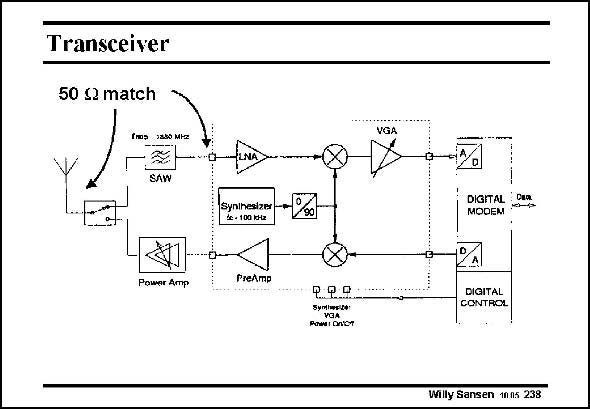

# SANSEN-238 · Transceiver

章节：23 低噪声放大器  
PDF 页：702；书本页：714；幻灯片编号：238  
状态：unreviewed



## 对应教材讲解

### PDF 702 · 书本 714

A transceiver consists of a receiver and a transmitter as shown in this slide. The input impedance matching is important for the LNA of the receiver for several reasons. First of all, reflections have to be avoided over the transmission line between the channel (SAW) filter and the LNA. Secondly, the LNA must provide the right load impedance to this channel filter. The input impedance of the LNA must be as close as possible to the source resistance R , which is usually 50 V. This is S called impedance matching. Moreover, the equivalent input noise must also be as small as possible. After all, the LNA is the first active amplification block. Going for the minimum Noise Figure is called noise matching. This has nothing to do with impedance matching. In practice, noise will be reduced as much as possible within the constraint of impedance matching. The LNA leads to the mixer. Again a 50 V transmission line is used depending on the distance

### PDF 703 · 书本 715

between LNA and mixer. If they are next to each other there is no need for a 50 V line. Higher output impedances can now be used in the LNA. Normally, a zero-IF or low-IF architecture is used. In any case, the LNA must have sufficient gain to avoid the noise of the mixer to appear at the antenna. Gains of 12–16 dB are typical.

## 公式／性能结论候选摘录

以下为规则截取的原文，尚未逐项判读。

- PDF 702: Again a 50 V transmission line is used depending on the distance
- PDF 703: In any case, the LNA must have sufficient gain to avoid the noise of the mixer to appear at the antenna.

## 曲线结论候选摘录

以下为规则截取的原文，尚未逐项判读。

（未由规则找到；不代表原页没有此类内容。）

## 原文条件与近似候选摘录

以下为规则截取的原文，尚未逐项判读。

（未由规则找到；不代表原页没有此类内容。）

## 幻灯片 OCR（未校正）

```text
Transceiver
50 12 match
frs Jato MIS
SAW
Poшer Amp
PseAmp
-i%
DIGITAL Can
MOOEM
Ф.49
Symiwele
VSA
Pomal Ontt
DIGITAL
CONTROL
Willy Sansen 1005 238
```

数学上下标、分数及正负号以原图为准。电路图已保留；未核对的连接不输出成可仿真 netlist。
