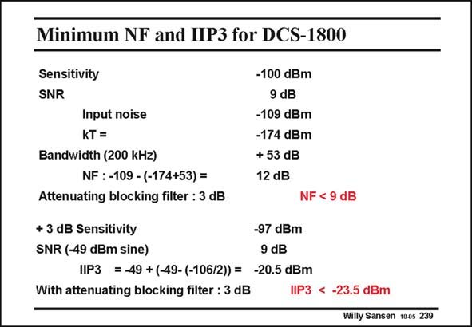

# SANSEN-239 · Minimum NF and IIP3 for DCS-1800

章节：23 低噪声放大器  
PDF 页：703；书本页：715；幻灯片编号：239  
状态：unreviewed



## 对应教材讲解

### PDF 703 · 书本 715

Let us take as an example, a DCS-1800 receiver. It operates at a carrier frequency of 1.8 GHz. Several sensitivities and values of Noise Figures are shown in this slide. Remember that 1 dBm is 1 mW in 50 V, which corresponds to 224 mV . A sen- RMS sitivity is specified of −100 dBm for an input SNR of 9 dB. The input noise must be at −109 dBm. The bandwidth is 200 kHz. The Noise Figure is 12 dB. If 3 dB loss is taken into account for the channel filter, then a Noise Figure of 9 dB is required. Let us now try to find out about the distortion. Distortion is important to avoid leakage from one channel to the adjacent channels. Especially intermodulation and cross-modulation distortion are to be avoided. Both are described by the 3rd-order intermodulation intercept (IIP3) as shown in Chapter 18. A minimum input signal is taken 3 dB higher than the sensitivity specifies. For a high input signal at −49 dBm, the SNR must still be 9 dB. The distortion specification now leads to a IIP3 of −20.5 dBm. Again, to take into account the attenuation in the preceding channel filter, 3 dB has to be subtracted, leading to an IIP3 of −23.5 dBm. Normally, MOST amplifiers can easily satisfy such a specification, depending on the choice of the V −V . GS T

## 公式／性能结论候选摘录

以下为规则截取的原文，尚未逐项判读。

- PDF 703: The bandwidth is 200 kHz.
- PDF 703: Normally, MOST amplifiers can easily satisfy such a specification, depending on the choice of the V −V .

## 曲线结论候选摘录

以下为规则截取的原文，尚未逐项判读。

（未由规则找到；不代表原页没有此类内容。）

## 原文条件与近似候选摘录

以下为规则截取的原文，尚未逐项判读。

（未由规则找到；不代表原页没有此类内容。）

## 幻灯片 OCR（未校正）

```text
Minimum NF and IIP3 for DCS-1800
Sensitivity
SNR
Input noise
kT =
Bandwidth (200 kHz)
NF: -109 - (-174+53) =
Attenuating blocking filter : 3 dB
-100 dBm
9 dB
-109 dBm
-174 dBm
+ 53 dB
12 dB
NF < 9 dB
+ 3 dB Sensitivity
-97 dBm
SNR (-49 dBm sine)
9 dB
IIP3 =-49 +(-49- (-106/2)) = -20.5 dBm
With attenuating blocking filter : 3 dB
IIP3 < -23.5 dBm
Willy Sansen 1005 239
```

数学上下标、分数及正负号以原图为准。电路图已保留；未核对的连接不输出成可仿真 netlist。
