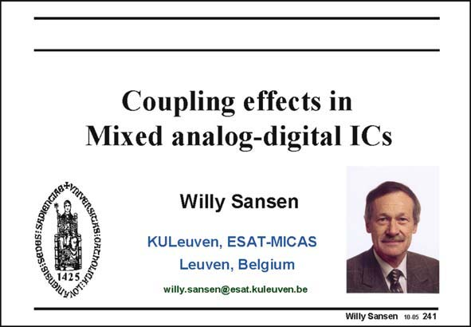

# SANSEN-241 · Slide 241

章节：24 数模混合集成电路中的耦合效应  
PDF 页：731；书本页：743；幻灯片编号：241  
状态：unreviewed



## 对应教材讲解

### PDF 731 · 书本 743

Today, most integrated circuit realizations include both digital and analog functions, on the same substrate. Processors include ADCs and DACs. RF functions are added to digital processors. Many more examples can be found. This means that coupling occurs between both types of circuits. Most often, the digital blocks generate spikes on the ground and supply lines, which are sensed by the analog amplifiers. To avoid deterioration of the dynamic range of these high-performance analog functions, coupling must be minimized. This is discussed in this Chapter. First of all, several sources of coupling are categorized. Layout techniques are now discussed to reduce coupling. Attention is also paid to the specification power-supply-rejection-ratio and how it can be predicted for some specific amplifier blocks.

## 公式／性能结论候选摘录

以下为规则截取的原文，尚未逐项判读。

（未由规则找到；不代表原页没有此类内容。）

## 曲线结论候选摘录

以下为规则截取的原文，尚未逐项判读。

（未由规则找到；不代表原页没有此类内容。）

## 原文条件与近似候选摘录

以下为规则截取的原文，尚未逐项判读。

（未由规则找到；不代表原页没有此类内容。）

## 幻灯片 OCR（未校正）

```text
gis:SeDUS: SAD1e
Coupling effects in
Mixed analog-digital ICs
Willy Sansen
KULeuven, ESAT-MICAS
Leuven, Belgium
willy.sansen@esat.kuleuven.be
Willy Sansen 10.0s 241
```

数学上下标、分数及正负号以原图为准。电路图已保留；未核对的连接不输出成可仿真 netlist。
