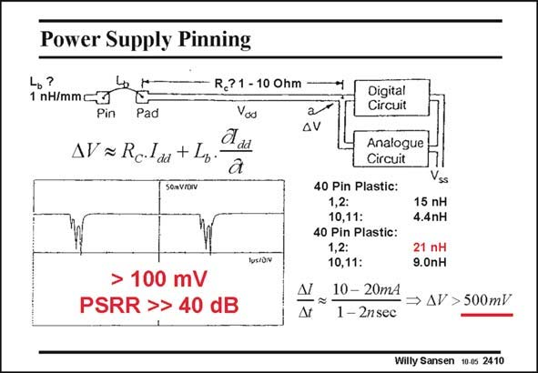

# SANSEN-2410 · Power Supply Pinning

章节：24 数模混合集成电路中的耦合效应  
PDF 页：735；书本页：747；幻灯片编号：2410  
状态：unreviewed



## 对应教材讲解

### PDF 735 · 书本 747

A pin of a chip package is normally connected over a bonding wire to a bonding pad. This pad then leads to the active circuits by means of metal lines. Both bonding wires and long metal lines, on chip and in the package, represent some resistance but especially inductance. At high frequencies (or clocks) this inductance can represent impedances of many Ohms. Indeed, fast clocks have short rise times and therefore generate large impedances. The voltage drop DV along this pad or line can now be considerable. A bonding wire has an inductance of about 1 nH/mm. Depending on which pin is contacted, the connection to the active circuit on the chip, can reach values up to 21 nH, for a 40-pin plastic package. A clock current spike of 20 mA with a 2 ns rise time causes a voltage drop of about 210 mV. Depending on the logic, values can be allowed up to 500 mV. This voltage drop is generated by the current to the digital circuit and appears on the supply line of both, the digital and analog circuit block. As a result the PSRR of the analog block will suffer heavily and will probably be no more than 40 dB.

## 公式／性能结论候选摘录

以下为规则截取的原文，尚未逐项判读。

- PDF 735: Indeed, fast clocks have short rise times and therefore generate large impedances.
- PDF 735: Depending on which pin is contacted, the connection to the active circuit on the chip, can reach values up to 21 nH, for a 40-pin plastic package.
- PDF 735: Depending on the logic, values can be allowed up to 500 mV.
- PDF 735: As a result the PSRR of the analog block will suffer heavily and will probably be no more than 40 dB.

## 曲线结论候选摘录

以下为规则截取的原文，尚未逐项判读。

（未由规则找到；不代表原页没有此类内容。）

## 原文条件与近似候选摘录

以下为规则截取的原文，尚未逐项判读。

（未由规则找到；不代表原页没有此类内容。）

## 幻灯片 OCR（未校正）

```text
Power Supply Pinning
Lь?
1 nH/mmc
Pin
Pad
R,?1 - 10 0hm
Vou
AV= RcIdd + Lb.
dd
Digital
Circuit
AV
lustow
> 100 mV
PSRR >> 40 dB
N/
Дr
Analogue
Circuit
40 Pin Plastic:
1,2:
10,11:
40 Pin Plastic:
1,2:
10,11:
10- 20mA
1 - 2nsec
15 nH
4.4nH
21 nH
9.0nH
→ ДV >500mV
Willy Sansen 10 0s 2410
```

数学上下标、分数及正负号以原图为准。电路图已保留；未核对的连接不输出成可仿真 netlist。
