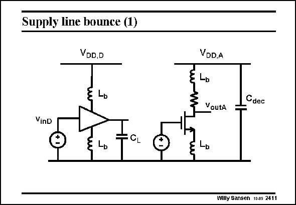

# SANSEN-2411 · Supply line bounce (1)

章节：24 数模混合集成电路中的耦合效应  
PDF 页：736；书本页：748；幻灯片编号：2411  
状态：unreviewed



## 对应教材讲解

### PDF 736 · 书本 748

The bonding wires also cause ground bounces and supply line bounces. This is illustrated in this slide. A digital gate with input voltage v and supply voltinD age V is in the neighbor- DD,D hood of an analog amplifier, this is biased at a certain current and has V as a DD,A supply voltage. The latter supply line has a decoupling capacitance C , to supdec press noise and ripple. All connections to the supply lines carry bonding wires. We monitor the output voltage of the analog amplifier v as a result of a digital input outA signal v . inD The only coupling between both circuits is along the ground line, which is common to both. Digital transitions at the output of the digital gate, are visible at the output of the analog amplifier, as shown next.

## 公式／性能结论候选摘录

以下为规则截取的原文，尚未逐项判读。

- PDF 736: We monitor the output voltage of the analog amplifier v as a result of a digital input outA signal v . inD The only coupling between both circuits is along the ground line, which is common to both.

## 曲线结论候选摘录

以下为规则截取的原文，尚未逐项判读。

（未由规则找到；不代表原页没有此类内容。）

## 原文条件与近似候选摘录

以下为规则截取的原文，尚未逐项判读。

（未由规则找到；不代表原页没有此类内容。）

## 幻灯片 OCR（未校正）

```text
Supply line bounce (1)
VDD.D
VDD,A
Lы
VoutA
Cdec
VinD
Willy Sansen 10.0s 2411
```

数学上下标、分数及正负号以原图为准。电路图已保留；未核对的连接不输出成可仿真 netlist。
