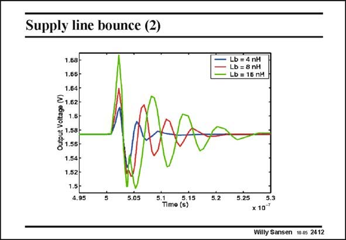

# SANSEN-2412 · Supply line bounce (2)

章节：24 数模混合集成电路中的耦合效应  
PDF 页：736；书本页：748；幻灯片编号：2412  
状态：unreviewed



## 对应教材讲解

### PDF 736 · 书本 748

Digital transitions of the digital gate, cause ringing indeed at the analog output. The size of it depends heavily on the values of the bond wire inductances. The larger the inductances, the larger the ringing. They have to be shortened, or replaced by flipchip bonding, as will be shown later. A more elaborate analysis of ground bounce is given in Badaroglu, JSSC July 2004, 1119–1130.

## 公式／性能结论候选摘录

以下为规则截取的原文，尚未逐项判读。

- PDF 736: The size of it depends heavily on the values of the bond wire inductances.

## 曲线结论候选摘录

以下为规则截取的原文，尚未逐项判读。

（未由规则找到；不代表原页没有此类内容。）

## 原文条件与近似候选摘录

以下为规则截取的原文，尚未逐项判读。

（未由规则找到；不代表原页没有此类内容。）

## 幻灯片 OCR（未校正）

```text
Supply line bounce (2)
1.68 -
1.65 -
1.64-
₴1.62-
ita
1.5-
1.58-
8 1.56-
1.54 -
1.52-
1.5 -
4.95
Lb = 4 nH
Lb = 8 nH
Lb = 15 nH
5.05
5 7im (875
5.2
5.25
5.3
x10'
Willy Sansen 10.0s 2412
```

数学上下标、分数及正负号以原图为准。电路图已保留；未核对的连接不输出成可仿真 netlist。
