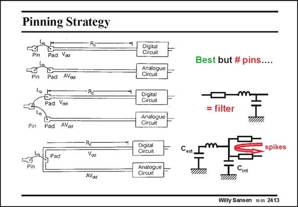

# SANSEN-2413 · Pinning Strategy

章节：24 数模混合集成电路中的耦合效应  
PDF 页：737；书本页：749；幻灯片编号：2413  
状态：unreviewed



## 对应教材讲解

### PDF 736 · 书本 748

The best strategy for pinning is therefore to avoid common supply lines or common ground lines altogether. The top solution is the best one. It costs one extra pin, however.

### PDF 737 · 书本 749

The other two solutions are poor. Each pad has a capacitance to ground and has an inductor in series to model the bond wire. It is now clear that both solutions form a filter from one supply to the other. The middle one is better than the bottom one. In the bottom connection, the pin itself and all external decoupling capacitors connected to that pin, are isolated from the supply lines because of the bonding-wire inductance. This is clearly the worst possible solution.

## 公式／性能结论候选摘录

以下为规则截取的原文，尚未逐项判读。

- PDF 736: The best strategy for pinning is therefore to avoid common supply lines or common ground lines altogether.

## 曲线结论候选摘录

以下为规则截取的原文，尚未逐项判读。

（未由规则找到；不代表原页没有此类内容。）

## 原文条件与近似候选摘录

以下为规则截取的原文，尚未逐项判读。

（未由规则找到；不代表原页没有此类内容。）

## 幻灯片 OCR（未校正）

```text
Pinning Strategy
Vas
AVod
Digital
Circuit
Analogue
Circuit|
Pad
Pad
Voa
Digital
Circurt
Analogue
Circuit
Pin
Pad
AVdo
Pad
RE
Vos
Digital
Circuit
Analogue
Circuйt
AVos
Best but # pins....
= filter
spikes
Cint
Willy Sansen 10.0s 2413
```

数学上下标、分数及正负号以原图为准。电路图已保留；未核对的连接不输出成可仿真 netlist。
