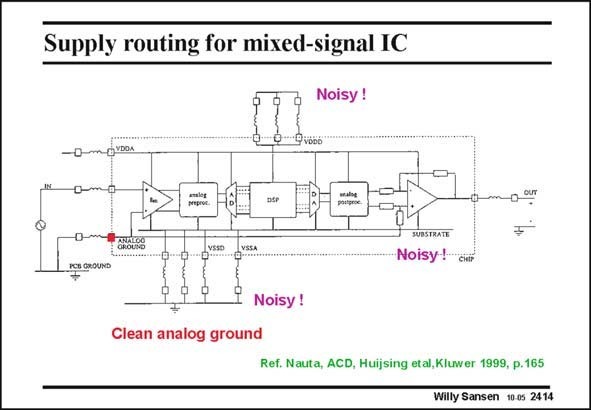

# SANSEN-2414 · Supply routing for mixed-signal IC

章节：24 数模混合集成电路中的耦合效应  
PDF 页：737；书本页：749；幻灯片编号：2414  
状态：unreviewed



## 对应教材讲解

### PDF 737 · 书本 749

The bonding wires again play an important role in this sensor preamplifier followed by a DSP block. Both the input and output are actually analog. The core is a DSP block preceded by a ADC and followed by a DAC. All this is on-chip, whereas the sensor itself and the output are off-chip. How to connect the supply lines and ground? The substrate is separated from the analog ground, which is reserved for the input and output amplifiers on-chip only and to the ground of the sensor off-chip. The substrate is taken out separately and connected externally to the supply ground line. Many parallel bonding-wires are used in parallel as this ground connection is common to both the analog circuits and digital blocks. Two separate pins are used however, for these ground connections VSSA and VSSD. The supply voltages also come in over two separate pins VDDA and VDDD. Again, multiple bonding wires are used for the digital supply pin. All necessary precautions have now been taken to avoid coupling. The most sensitive point for coupling is at the analog ground of the input amplifier. As no differential sensor is used, this point will pick up noise from the substrate and from the external PCB ground. Differential sensors are therefore always preferred.

## 公式／性能结论候选摘录

以下为规则截取的原文，尚未逐项判读。

- PDF 737: Differential sensors are therefore always preferred.

## 曲线结论候选摘录

以下为规则截取的原文，尚未逐项判读。

（未由规则找到；不代表原页没有此类内容。）

## 原文条件与近似候选摘录

以下为规则截取的原文，尚未逐项判读。

（未由规则找到；不代表原页没有此类内容。）

## 幻灯片 OCR（未校正）

```text
Supply routing for mixed-signal IC
Noisy !
Noisy!
Noisy !
Clean analog
ground
Ref. Nauta, ACD, Huijsing etal,Kluwer 1999, p.165
Willy Sansen 10.05 2414
```

数学上下标、分数及正负号以原图为准。电路图已保留；未核对的连接不输出成可仿真 netlist。
