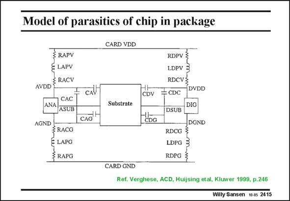

# SANSEN-2415 · Model of parasitics of chip in package

章节：24 数模混合集成电路中的耦合效应  
PDF 页：738；书本页：750；幻灯片编号：2415  
状态：unreviewed



## 对应教材讲解

### PDF 738 · 书本 750

It is not always easy to model the coupling between the analog and digital blocks. A network of resistors and capacitors can be used, as shown in this slide. However it is a non-trivial task to obtain realistic values of all these components. Both the analog and the digital blocks are coupled by means of capacitors to a common substrate, which can be modeled as a grid of resistors and capacitors. Both the analog and the digital blocks have separate pins for supply lines and ground. They all consist of inductors in series with small resistors. The external supply line and ground are on top and at the bottom. This applies to analog and digital blocks which are sufficiently small such that they do not have to be subdivided over more blocks. If this is the case, then the simulation time grows considerably.

## 公式／性能结论候选摘录

以下为规则截取的原文，尚未逐项判读。

（未由规则找到；不代表原页没有此类内容。）

## 曲线结论候选摘录

以下为规则截取的原文，尚未逐项判读。

（未由规则找到；不代表原页没有此类内容。）

## 原文条件与近似候选摘录

以下为规则截取的原文，尚未逐项判读。

（未由规则找到；不代表原页没有此类内容。）

## 幻灯片 OCR（未校正）

```text
Model of parasitics of chip in package
CARD VDD
RAPY
§ LAPV
AVDD E RACV
CАC*
ANA
ASUB
AGND
≤ RACG
C LAPG
RAPG
CAV
CAỐ-
Substrate
CARD GND
CDV
CDG
RDPV &
LDPV 3
RDCV}
÷CDC DVDD
DIG
DSUB
DGND
RDCG ≤
LDPG 3
RDPG 3
Ref. Verghese, ACD, Huijsing etal, Kluwer 1999, p.246
Willy Sansen 10.05 2415
```

数学上下标、分数及正负号以原图为准。电路图已保留；未核对的连接不输出成可仿真 netlist。
