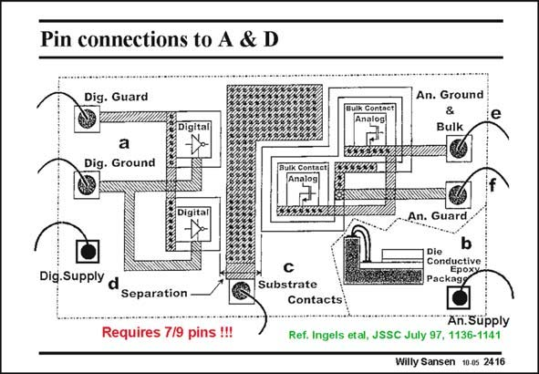

# SANSEN-2416 · Pin connections to A & D

章节：24 数模混合集成电路中的耦合效应  
PDF 页：738；书本页：750；幻灯片编号：2416  
状态：unreviewed



## 对应教材讲解

### PDF 738 · 书本 750

In this example, we try to find out what is a reasonable number of pins. The maximum number of pins is nine. This is evidently rarely acceptable. Some of the pins can be combined to reduce this number, as explained now. The nine pins can be divided into four for the analog part, four for the digital part and one for the screen in the middle. This screen is a metal plate with a certain width to physically separate the analog blocks from the digital ones as far as necessary. It should also go as deep as possible. It is therefore connected to an underlying deep diffusion. The four pins of the analog part are the following: – the positive supply line – the ground line

### PDF 739 · 书本 751

– the substrate (bulk) – the guard rings. Occasionally, the substrate can be connected to one of the supply lines (positive supply or ground). This is not always advisable however, as will be shown later. The guard rings are diffusions surrounding the most sensitive analog amplifiers. They are meant to take up noise coming laterally from the digital parts. Of course, they do not pick up a great deal of noise arriving vertically. This will also be discussed later in more detail. Digital blocks can also have four pins, although in practice only two of them are used, the positive supply line and ground.

## 公式／性能结论候选摘录

以下为规则截取的原文，尚未逐项判读。

- PDF 738: It is therefore connected to an underlying deep diffusion.

## 曲线结论候选摘录

以下为规则截取的原文，尚未逐项判读。

（未由规则找到；不代表原页没有此类内容。）

## 原文条件与近似候选摘录

以下为规则截取的原文，尚未逐项判读。

（未由规则找到；不代表原页没有此类内容。）

## 幻灯片 OCR（未校正）

```text
Pin connections to A & D
Dig. Guard
An. Ground
Bulk
a
Dig. Ground
Digital
An. Guard
b
Die
Conductive
Ероху
Packagя
Dig.Supply
d
Separation
Substrate
Contacts
Requires 7/9 pins !!!
An.Supply
Ref. Ingels etal, JSSC July 97, 1136-1141
Willy Sansen 10 0s 2416
```

数学上下标、分数及正负号以原图为准。电路图已保留；未核对的连接不输出成可仿真 netlist。
