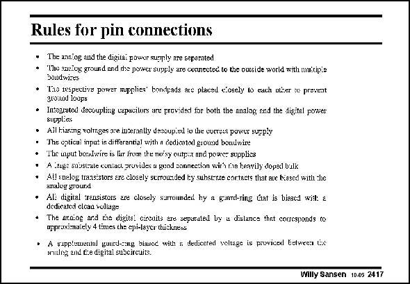

# SANSEN-2417 · Rules for pin connections • The analog and the digila: power sumply are separated

章节：24 数模混合集成电路中的耦合效应  
PDF 页：739；书本页：751；幻灯片编号：2417  
状态：unreviewed



## 对应教材讲解

### PDF 739 · 书本 751

These conclusions are repeated, together with some useful suggestions about the layout. They speak for themselves.

## 公式／性能结论候选摘录

以下为规则截取的原文，尚未逐项判读。

（未由规则找到；不代表原页没有此类内容。）

## 曲线结论候选摘录

以下为规则截取的原文，尚未逐项判读。

（未由规则找到；不代表原页没有此类内容。）

## 原文条件与近似候选摘录

以下为规则截取的原文，尚未逐项判读。

（未由规则找到；不代表原页没有此类内容。）

## 幻灯片 OCR（未校正）

```text
Rules for pin connections
• The analog and the digila: power sumply are separated
Tho suntog ground and die posver supply are connected. to the ouside world with muttipte
bondwires
* Ioins peciys pewer maplie tondas are placed c'osely do each nier t provent
• Intogated desoupling capucitors ure provided for both the analog and the digitel power
supplies
• Ail hiaring voltnges are inserantly decoupied io the corrgut power sueply
• The opticul input in diffarantial with a dedicated ground bondwin!
• The mput bozdwire is lar froum the noisy outpur nnd poaer supplies
• A lange subscate contac, provides a geod sonnection wirh rae henvily doped bulk
• All snelog transistors are closely strrounded ey suhstrtte cortacts that ave biased with he
analey ground
• Ali digital transiscors are olosely surrounded hy a rund-ring caat is biased with a
dedicatoi eloau voltage
• The aroiog and tia digital cirouits are sepitated by u distunes thet coucsponds ro
usproximately 4 times the cpi-laver tückness
• A sipplomettal guurdsing biasod with & dediceted veltage is proviced Eetweca tx
wmalig end tte digital subcircuits.
Willy Sansen 10.05 2417
```

数学上下标、分数及正负号以原图为准。电路图已保留；未核对的连接不输出成可仿真 netlist。
