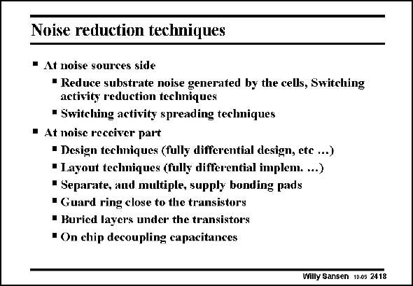

# SANSEN-2418 · Noise reduction techniques

章节：24 数模混合集成电路中的耦合效应  
PDF 页：739；书本页：751；幻灯片编号：2418  
状态：unreviewed



## 对应教材讲解

### PDF 739 · 书本 751

Another way to summarize the techniques to reduce noise pick up is given in this slide. Some effort is also being made to reduce the generation of noise. The spreading of the digital activity may help to reduce the spectral content of the noise generated. On the analog (receiver) side we notice that buried layers are suggested to screen the transistors from the noise coming in vertically. This is a very effective technique, indeed. On the other hand, buried layers are not always available.

### PDF 740 · 书本 752

Quite often, considerable space is allotted to decoupling capacitances. These are small capacitances connected locally to provide low impedances to ground at high frequencies.

## 公式／性能结论候选摘录

以下为规则截取的原文，尚未逐项判读。

（未由规则找到；不代表原页没有此类内容。）

## 曲线结论候选摘录

以下为规则截取的原文，尚未逐项判读。

（未由规则找到；不代表原页没有此类内容。）

## 原文条件与近似候选摘录

以下为规则截取的原文，尚未逐项判读。

（未由规则找到；不代表原页没有此类内容。）

## 幻灯片 OCR（未校正）

```text
Noise reduction techniques
• At noise sources side
• Reduce substrate noise generated by the cells, Switching
activity reduction techniques
• Switching activity spreading techniques
• At noise receiver part
• Design techniques (fully differential design, ete ...)
• Layout techmiques (fully differential implem....)
• Separate, and multiple, supply bonding pads
• Guard ring close to the transistors
• Buried layers under the transistors
• On chip decoupling capacitances
Willy Sansen 10.05 2418
```

数学上下标、分数及正负号以原图为准。电路图已保留；未核对的连接不输出成可仿真 netlist。
