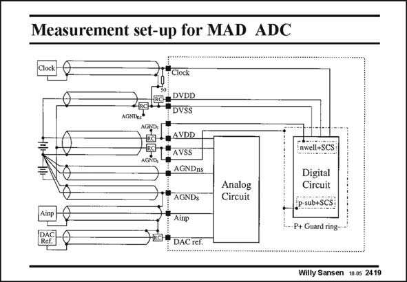

# SANSEN-2419 · Measurement set-up for MAD ADC

章节：24 数模混合集成电路中的耦合效应  
PDF 页：740；书本页：752；幻灯片编号：2419  
状态：unreviewed



## 对应教材讲解

### PDF 740 · 书本 752

Actually, the same techniques to avoid coupling of noise is applicable for printed-circuit boards (PCB) as for silicon chips. This is why an example is given of a printed-circuit board with an analog block and a digital block. It is to be connected to several pieces of equipment. It is clear that all supply lines are separated. Moreover, the shielding of all connecting cables is connected to the external ground separately. The substrate or the ground plane of the PCB is also connected separately to the external ground.

## 公式／性能结论候选摘录

以下为规则截取的原文，尚未逐项判读。

（未由规则找到；不代表原页没有此类内容。）

## 曲线结论候选摘录

以下为规则截取的原文，尚未逐项判读。

（未由规则找到；不代表原页没有此类内容。）

## 原文条件与近似候选摘录

以下为规则截取的原文，尚未逐项判读。

（未由规则找到；不代表原页没有此类内容。）

## 幻灯片 OCR（未校正）

```text
Measurement set-up for MAD ADC
Clock
BaJESA DVDD
"DVSS
ACHD
RG-BAVDD
EC+"AVSS
AGNA
, AGNDnS
t AGNDS
Аinр
DAC ref.
Analog
Circuit
nwell+SCS
Digital
Circuit
ip-sub+SCS:
P+ Guard ring-
Willy Sansen 10-0s 2419
```

数学上下标、分数及正负号以原图为准。电路图已保留；未核对的连接不输出成可仿真 netlist。
