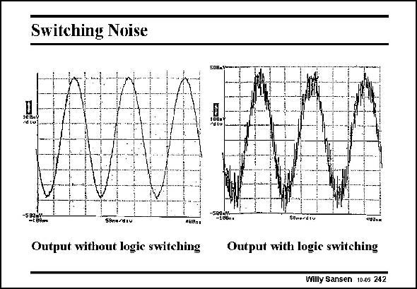

# SANSEN-242 · Switching Noise

章节：24 数模混合集成电路中的耦合效应  
PDF 页：731；书本页：743；幻灯片编号：242  
状态：unreviewed



## 对应教材讲解

### PDF 731 · 书本 743

Coupling is best visible when a sinusoidal waveform is analyzed with high spectral purity. Switching on the logic functions on the same substrate, induces high-frequency noise on the waveform. This is a result of coupling. It deteriorates drastically the SNR. This is what has to be avoided in present-day mixed-signal circuits.

## 公式／性能结论候选摘录

以下为规则截取的原文，尚未逐项判读。

（未由规则找到；不代表原页没有此类内容。）

## 曲线结论候选摘录

以下为规则截取的原文，尚未逐项判读。

（未由规则找到；不代表原页没有此类内容。）

## 原文条件与近似候选摘录

以下为规则截取的原文，尚未逐项判读。

（未由规则找到；不代表原页没有此类内容。）

## 幻灯片 OCR（未校正）

```text
Switching Noise
4GBns
Output without logie switching
Seme2d10
Output with logie switching
Willy Sansen 10.05 242
```

数学上下标、分数及正负号以原图为准。电路图已保留；未核对的连接不输出成可仿真 netlist。
