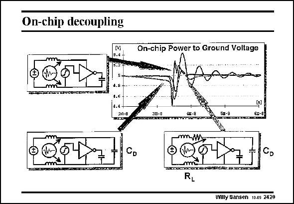

# SANSEN-2420 · On-chip decoupling

章节：24 数模混合集成电路中的耦合效应  
PDF 页：740；书本页：752；幻灯片编号：2420  
状态：unreviewed



## 对应教材讲解

### PDF 740 · 书本 752

On-chip decoupling may not always work. An example is given in this slide where decoupling does more harm than good. A single digital gate is used. It is switched by application of a logic one. It is loaded by a load capacitor. Its supply lines are connected over bonding wire inductors. The supply voltage is measured at the terminals of the gate. Without decoupling capacitance, high-frequency ringing is detected on the supply line. The addition of a decoupling capacitance C across the D gate terminals, causes ringing of this capacitor with the bonding wire inductors. It has a lower frequency than before, but is larger in amplitude. Addition of series resistors R dampens this ringing but also causes a DC voltage drop along L the supply lines, which is to be avoided.

## 公式／性能结论候选摘录

以下为规则截取的原文，尚未逐项判读。

（未由规则找到；不代表原页没有此类内容。）

## 曲线结论候选摘录

以下为规则截取的原文，尚未逐项判读。

（未由规则找到；不代表原页没有此类内容。）

## 原文条件与近似候选摘录

以下为规则截取的原文，尚未逐项判读。

（未由规则找到；不代表原页没有此类内容。）

## 幻灯片 OCR（未校正）

```text
On-chip decoupling
On-chip Power to Ground Voltage
CD
Willy Sansen 10.05 2420
```

数学上下标、分数及正负号以原图为准。电路图已保留；未核对的连接不输出成可仿真 netlist。
