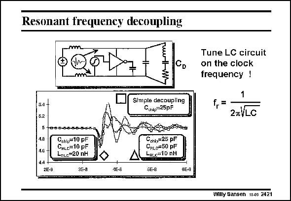

# SANSEN-2421 · Resonant frequeney decoupling

章节：24 数模混合集成电路中的耦合效应  
PDF 页：741；书本页：753；幻灯片编号：2421  
状态：unreviewed



## 对应教材讲解

### PDF 741 · 书本 753

A better solution is to add a series resonant RLC circuit across the decoupling capacitor C . D A series resonant RLC circuit provides a null in the impedance (see Chapter 22) at its resonant frequency f . r It is therefore an ideal circuit to dampen oscillation at this frequency. If its resonant frequency can be tuned at the ringing frequency of the decoupling capacitor with the bonding wire inductors, then the damping will stop the ringing. If this ringing occurs at the clock frequency, then it is fairly easy to tune this series RLC circuit to this clock frequency. It is not as critical as it sounds. Some typical values are given in this slide.

## 公式／性能结论候选摘录

以下为规则截取的原文，尚未逐项判读。

- PDF 741: D A series resonant RLC circuit provides a null in the impedance (see Chapter 22) at its resonant frequency f . r It is therefore an ideal circuit to dampen oscillation at this frequency.

## 曲线结论候选摘录

以下为规则截取的原文，尚未逐项判读。

（未由规则找到；不代表原页没有此类内容。）

## 原文条件与近似候选摘录

以下为规则截取的原文，尚未逐项判读。

（未由规则找到；不代表原页没有此类内容。）

## 幻灯片 OCR（未校正）

```text
Resonant frequeney decoupling
C
D
3.4 +
5.2
Simpte decoupling
Caip=25pF
1.8
1.G
4.4-
2E-8
17-0-0-0-0-8-0-07-0-13
Cchl,=10 pF
CHLc=10 pF
LnLe=20 nH
35-8
4E-S
Cchis=25 pF
CRLo=50 pF
LRLe=10 nH
SE-B
GE-9
Tune LC circuit
on the clock
frequency !
f,= -
2nVLC
Willy Sansen 10.05 2421
```

数学上下标、分数及正负号以原图为准。电路图已保留；未核对的连接不输出成可仿真 netlist。
