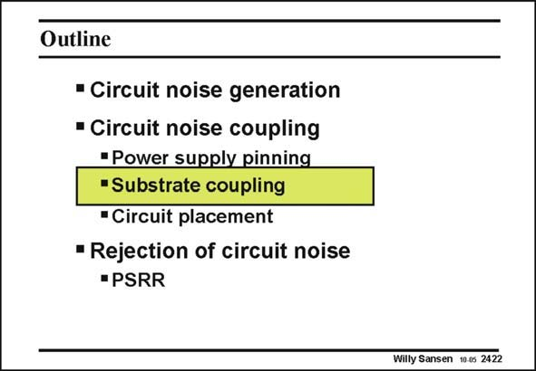

# SANSEN-2422 · Slide 2422

章节：24 数模混合集成电路中的耦合效应  
PDF 页：741；书本页：753；幻灯片编号：2422  
状态：unreviewed



## 对应教材讲解

### PDF 741 · 书本 753

Now that we have a better view on how to cope with the bonding wire inductors, let us see how the substrate itself plays a role. It is clear that the substrate is most responsible for the transmission of the noise from the digital part to the analog part.

## 公式／性能结论候选摘录

以下为规则截取的原文，尚未逐项判读。

（未由规则找到；不代表原页没有此类内容。）

## 曲线结论候选摘录

以下为规则截取的原文，尚未逐项判读。

（未由规则找到；不代表原页没有此类内容。）

## 原文条件与近似候选摘录

以下为规则截取的原文，尚未逐项判读。

（未由规则找到；不代表原页没有此类内容。）

## 幻灯片 OCR（未校正）

```text
Outline
• Circuit noise generation
• Circuit noise coupling
"Power supply pinning
"Substrate coupling
• Circuit placement
• Rejection of circuit noise
• PSRR
Willy Sansen 10 0s 2422
```

数学上下标、分数及正负号以原图为准。电路图已保留；未核对的连接不输出成可仿真 netlist。
