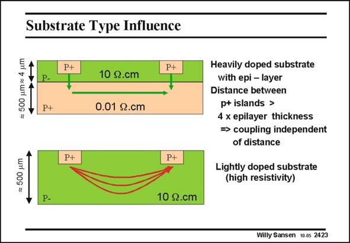

# SANSEN-2423 · Substrate Type Influence

章节：24 数模混合集成电路中的耦合效应  
PDF 页：742；书本页：754；幻灯片编号：2423  
状态：unreviewed



## 对应教材讲解

### PDF 741 · 书本 753

Several possible substrates are shown in this slide. The top one has an epitaxial layer, whereas the other one has not. The epitaxial layer is usually doped fairly low (with high resistivity) so as to set the MOST characteristics. The substrate however, is highly doped (with low resistivity) to allow current flow with low voltage drops. As a consequence, the current reaches the p+ diffusion from the Injector to the Receiver in a vertical direction. Also, as the substrate has low resistivity, the

### PDF 742 · 书本 754

distance between Injector and Receiver does not matter. One of the questions is, how close can the Injector be to the Drain before horizontal current flows in the epitaxial layer? The answer is that if the distance between both diffusions is smaller than about 4 times the thickness of the epitaxial layer, then horizontal current can also be expected in the epitaxial layer. This is the case if no epitaxial layer is present. The whole substrate is now lowly doped. As a consequence, the current from the left p+ island (the Injector) spreads into the substrate to be collected again at the right p+ island, or the Receiver. Both horizontal and vertical currents are then present around the p+ island. In this case, the distance will play a role: the larger the distance, the larger the resistance between both islands.

## 公式／性能结论候选摘录

以下为规则截取的原文，尚未逐项判读。

（未由规则找到；不代表原页没有此类内容。）

## 曲线结论候选摘录

以下为规则截取的原文，尚未逐项判读。

- PDF 741: The epitaxial layer is usually doped fairly low (with high resistivity) so as to set the MOST characteristics.

## 原文条件与近似候选摘录

以下为规则截取的原文，尚未逐项判读。

（未由规则找到；不代表原页没有此类内容。）

## 幻灯片 OCR（未校正）

```text
Substrate Type Influence
= 500 um= 4 um
PH
10 2.cm
P+
P+
0.01 2.cm
= 500 um
P+
P+|
P-
10 .cm
Heavily doped substrate
with epi - layer
Distance between
p+ islands >
4 x epilayer thickness
= coupling independent
of distance
Lightly doped substrate
(high resistivity)
Willy Sansen 10 0s 2423
```

数学上下标、分数及正负号以原图为准。电路图已保留；未核对的连接不输出成可仿真 netlist。
