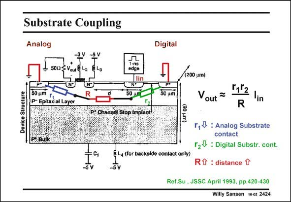

# SANSEN-2424 · Substrate Coupling

章节：24 数模混合集成电路中的耦合效应  
PDF 页：742；书本页：754；幻灯片编号：2424  
状态：unreviewed



## 对应教材讲解

### PDF 742 · 书本 754

In this experiment, the influence of the distance between the Injector (at the right) and the Receiver (at the left) is investigated in more detail. A short current pulse is injected at a n+ island. This is expected to cause a current to both p+ grounds, the digital ground at the right, and the analog ground at the far left. A nMOST transistor is added at the left. It is biased as a source follower with a 50 V Source resistor, at which node the output voltage is measured. The left p+ island is connected to the analog ground, but is actually the substrate contact for the analog part, which is here the nMOST Source follower. The lateral resistor between this substrate contact and the Source of the nMOST is denoted by r . It must be made smaller in size. 1 In a similar way, the lateral resistor between the digital injector and its substrate contact is denoted by r . It must also be made smaller. 2

### PDF 743 · 书本 755

The lateral distance between the analog nMOST and the digital injector is denoted by resistor R. The larger this R is the better. Indeed the Voltage V sensed at the Source of the nMOST Source follower, as a result of out the input current I , is as given in this slide. This current flows mainly to its digital ground and in causes a voltage r I , in the epitaxial layer, underneath the digital p+ island. This voltage is 2 in then sensed at the output through a potentiometric divider of R and r . 1

## 公式／性能结论候选摘录

以下为规则截取的原文，尚未逐项判读。

- PDF 743: Indeed the Voltage V sensed at the Source of the nMOST Source follower, as a result of out the input current I , is as given in this slide.

## 曲线结论候选摘录

以下为规则截取的原文，尚未逐项判读。

（未由规则找到；不代表原页没有此类内容。）

## 原文条件与近似候选摘录

以下为规则截取的原文，尚未逐项判读。

（未由规则找到；不代表原页没有此类内容。）

## 幻灯片 OCR（未校正）

```text
Substrate Coupling
Analog
Digital
50(2
(200 um)
Device Structure
50 um
P- Epitaxial Layer
50 g
P* Channel Stop Implant!
§ L4 (for backside contact only)
50 um
Vout ™
r1lz
R
in
r,& : Analog Substrate
contact
r20 : Digital Substr. cont.
Rt : distance
Ref.Su , JSSC April 1993, pp.420-430
Willy Sansen 10-05 2424
```

数学上下标、分数及正负号以原图为准。电路图已保留；未核对的连接不输出成可仿真 netlist。
