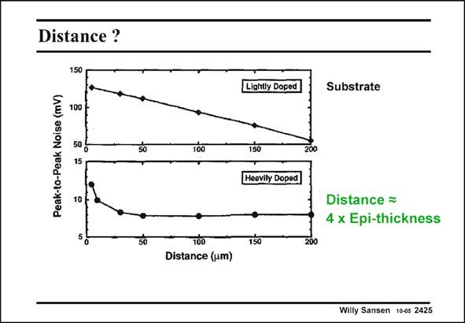

# SANSEN-2425 · Distance ?

章节：24 数模混合集成电路中的耦合效应  
PDF 页：743；书本页：755；幻灯片编号：2425  
状态：unreviewed



## 对应教材讲解

### PDF 743 · 书本 755

The output voltage V is out given in this slide, versus distance between Injector and Receiver. On a lightly doped substrate, without epitaxial layer, the currents flows through a large resistance. As a result, the output voltage is large and inversely proportional to the distance. When a lightly doped epitaxial layer is added on top, the result is the same. Indeed, the current still encounters a large resistance, which is proportional to the distance. Only when a heavily-doped substrate is used, all the current flows directly to the substrate and along the substrate to the other island. The distance is no longer of any importance. Moreover, the output voltage is small because the substrate resistance is small. Only when the distance between both islands is smaller than 3–4 times the epitaxial thickness, some current now flows through the epitaxial layer. The resistance is higher and so is the output voltage. A designer must be aware of the kind of substrate that is being used in this particular CMOS technology.

## 公式／性能结论候选摘录

以下为规则截取的原文，尚未逐项判读。

- PDF 743: As a result, the output voltage is large and inversely proportional to the distance.
- PDF 743: Indeed, the current still encounters a large resistance, which is proportional to the distance.

## 曲线结论候选摘录

以下为规则截取的原文，尚未逐项判读。

（未由规则找到；不代表原页没有此类内容。）

## 原文条件与近似候选摘录

以下为规则截取的原文，尚未逐项判读。

（未由规则找到；不代表原页没有此类内容。）

## 幻灯片 OCR（未校正）

```text
Distance ?
150
100
Peak-to-Peak Noise (mV)
50
10
50
100
100
Distance (um)
Lightly Doped
Substrate
150
Heavily Doped
Distance =
4 x Epi-thickness
150
200
Willy Sansen 10-05 2425
```

数学上下标、分数及正负号以原图为准。电路图已保留；未核对的连接不输出成可仿真 netlist。
