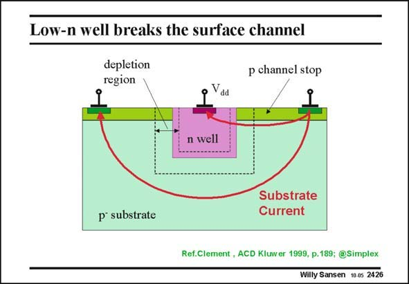

# SANSEN-2426 · Low-n well breaks the surface channel

章节：24 数模混合集成电路中的耦合效应  
PDF 页：744；书本页：756；幻灯片编号：2426  
状态：unreviewed



## 对应教材讲解

### PDF 743 · 书本 755

If no epitaxial layer is present, the extension of the distance is now about the only remedy left to reduce coupling. This is not quite true. The third dimension can be used as well. An example is given in this slide. Between the injector (on the right) and the receiver, a deep diffusion is added (such as the n-well), connected to the supply voltage. As a result, a wide depletion region is added.

### PDF 744 · 书本 756

This n-well diffusion with its depletion region acts as an isolator between Injector and Receiver. In this way, the current path from Injector to Receiver is made longer, the resistance larger and the coupling weaker.

## 公式／性能结论候选摘录

以下为规则截取的原文，尚未逐项判读。

- PDF 743: As a result, a wide depletion region is added.

## 曲线结论候选摘录

以下为规则截取的原文，尚未逐项判读。

（未由规则找到；不代表原页没有此类内容。）

## 原文条件与近似候选摘录

以下为规则截取的原文，尚未逐项判读。

（未由规则找到；不代表原页没有此类内容。）

## 幻灯片 OCR（未校正）

```text
Low-n well breaks the surface channel
depletion
region
p channel stop
Vad
n well
p substrate
Substrate
Current
Ref.Clement, ACD Kluwer 1999, p.189;@Simplex
Willy Sansen 10 0s 2426
```

数学上下标、分数及正负号以原图为准。电路图已保留；未核对的连接不输出成可仿真 netlist。
