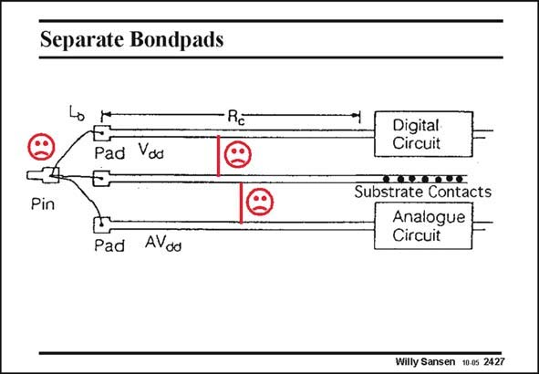

# SANSEN-2427 · Separate Bondpads

章节：24 数模混合集成电路中的耦合效应  
PDF 页：744；书本页：756；幻灯片编号：2427  
状态：unreviewed



## 对应教材讲解

### PDF 744 · 书本 756

Remember that all these contacts need separate pins. As an example, a supply line (or ground line) of a digital block which runs in parallel with a supply line (or ground line) of analog block, and gives capacitive coupling. A deep diffusion with metal on top between both reduces significantly the coupling. Even better, is to lead the three bonding wires to different pins.

## 公式／性能结论候选摘录

以下为规则截取的原文，尚未逐项判读。

（未由规则找到；不代表原页没有此类内容。）

## 曲线结论候选摘录

以下为规则截取的原文，尚未逐项判读。

（未由规则找到；不代表原页没有此类内容。）

## 原文条件与近似候选摘录

以下为规则截取的原文，尚未逐项判读。

（未由规则找到；不代表原页没有此类内容。）

## 幻灯片 OCR（未校正）

```text
Separate Bondpads
→ *
E.
Pad Voo
Rc
Pin
Pad AVdd
Digital
Circuit
Substrate Contacts
Analogue
Circuit
Willy Sansen 10 0s 2427
```

数学上下标、分数及正负号以原图为准。电路图已保留；未核对的连接不输出成可仿真 netlist。
