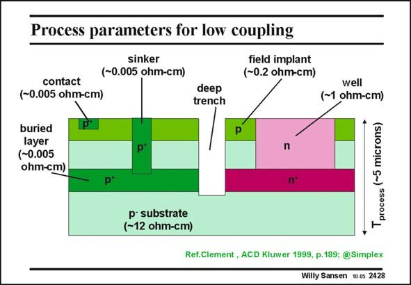

# SANSEN-2428 · Process parameters for low coupling field implant

章节：24 数模混合集成电路中的耦合效应  
PDF 页：745；书本页：757；幻灯片编号：2428  
状态：unreviewed



## 对应教材讲解

### PDF 745 · 书本 757

Deeper isolation is obtained by deep trench isolation between Injector and Receiver. In the example in this slide, a deep trench is etched between the areas on the left and the right. Moreover, both areas have a buried layer, which are ideal to screen away currents coming in vertically. The right n-well houses pMOST devices, whereas the area on the left houses nMOST devices. The isolation between both is quasi perfect as it cuts through most of the silicon. Taking two different chips is even more perfect, but requires more expensive packaging.

## 公式／性能结论候选摘录

以下为规则截取的原文，尚未逐项判读。

（未由规则找到；不代表原页没有此类内容。）

## 曲线结论候选摘录

以下为规则截取的原文，尚未逐项判读。

（未由规则找到；不代表原页没有此类内容。）

## 原文条件与近似候选摘录

以下为规则截取的原文，尚未逐项判读。

（未由规则找到；不代表原页没有此类内容。）

## 幻灯片 OCR（未校正）

```text
Process parameters for low coupling
sinker
(-0.005 ohm-cm)
field implant
(-0.2 ohm-cm)
contact
(~0.005 ohm-cm)
buried
layer
(-0.005
ohm-cm)
deep
trench
P*
n
p*
n"
p substrate
(-12 ohm-cm)
well
(~1 ohm-cm)
process (~5 microns)
Ref.Clement , ACD Kluwer 1999, p.189: @Simplex
Willy Sansen 10 0s 2428
```

数学上下标、分数及正负号以原图为准。电路图已保留；未核对的连接不输出成可仿真 netlist。
