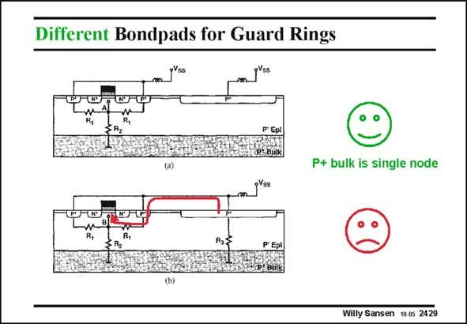

# SANSEN-2429 · Different Bondpads for Guard Rings

章节：24 数模混合集成电路中的耦合效应  
PDF 页：745；书本页：757；幻灯片编号：2429  
状态：unreviewed



## 对应教材讲解

### PDF 745 · 书本 757

Guard rings are ideal to screen away currents coming in horizontally. This is illustrated in this slide. Guard rings are highlydoped diffusion rings around a sensitive transistor or amplifier stage, with the same doping as the underlying material. In a p− epitaxial layer, they are shallow p+ diffusions, as shown in this slide. Their purpose is to pick up the current which comes in horizontally along the epitaxial layer and along the surface and to lead it outside. The substrate contact (on the right) is normally separate. Moreover it is better connected to a separate pin as well, as shown on top. If the substrate contact and guard ring contact are connected together, to save a pin, as shown at the bottom, the current from the substrate contact can re-enter the silicon through the guardring contact and reach the transistor. This is better to be avoided.

## 公式／性能结论候选摘录

以下为规则截取的原文，尚未逐项判读。

（未由规则找到；不代表原页没有此类内容。）

## 曲线结论候选摘录

以下为规则截取的原文，尚未逐项判读。

（未由规则找到；不代表原页没有此类内容。）

## 原文条件与近似候选摘录

以下为规则截取的原文，尚未逐项判读。

（未由规则找到；不代表原页没有此类内容。）

## 幻灯片 OCR（未校正）

```text
Different Bondpads for Guard Rings
P+ bulk is single node
Willy Sansen 10.0s 2429
```

数学上下标、分数及正负号以原图为准。电路图已保留；未核对的连接不输出成可仿真 netlist。
